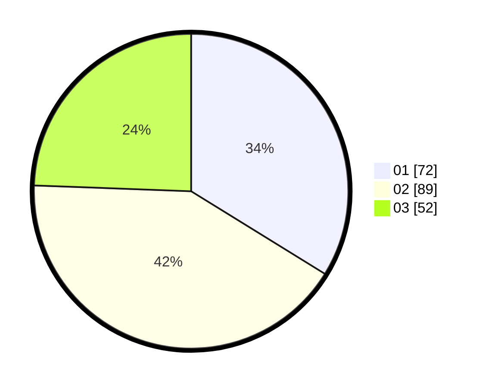

# Hasil

Hasil perolehan suara paslon dapat dilihat pada file paslon-01.txt, paslon-02.txt, dan paslon-03.txt.

Jika tidak ada, artinya data tersebut belum ada pada SIREKAP.

## Perolehan Suara

 * Paslon 01: **72**.
 * Paslon 02: **89**.
 * Paslon 03: **52**.

## Foto C Plano

https://sirekap-obj-formc.kpu.go.id/241c/pemilu/ppwp/31/74/03/10/03/3174031003079-20240214-214355--e83d5df2-6f1a-4c96-8240-0a0f27e651b6.jpg

https://sirekap-obj-formc.kpu.go.id/241c/pemilu/ppwp/31/74/03/10/03/3174031003079-20240214-214404--3a563aab-042c-4247-965a-f9f23f104f62.jpg

https://sirekap-obj-formc.kpu.go.id/241c/pemilu/ppwp/31/74/03/10/03/3174031003079-20240214-214411--99e8ab15-4c51-448d-952f-40c6d967cec5.jpg
