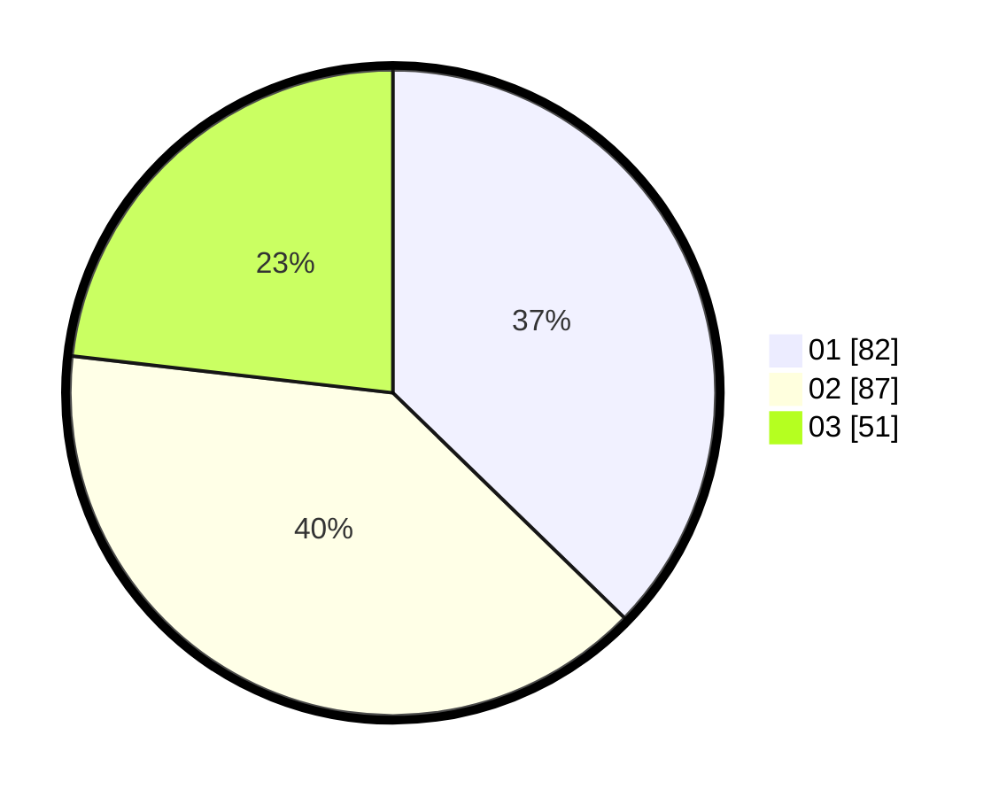

# Hasil

Hasil perolehan suara paslon dapat dilihat pada file paslon-01.txt, paslon-02.txt, dan paslon-03.txt.

Jika tidak ada, artinya data tersebut belum ada pada SIREKAP.

## Perolehan Suara

 * Paslon 01: **82**.
 * Paslon 02: **87**.
 * Paslon 03: **51**.

## Foto C Plano

https://sirekap-obj-formc.kpu.go.id/1f49/pemilu/ppwp/31/74/03/10/03/3174031003083-20240215-204156--52fbd96d-c4f5-4d51-81aa-39f1e431c66d.jpg

https://sirekap-obj-formc.kpu.go.id/1f49/pemilu/ppwp/31/74/03/10/03/3174031003083-20240215-004714--7791b86c-b5c6-4fbf-a641-40a77542490d.jpg

https://sirekap-obj-formc.kpu.go.id/1f49/pemilu/ppwp/31/74/03/10/03/3174031003083-20240215-004730--da471097-0c19-44df-b421-557b1b930d63.jpg
