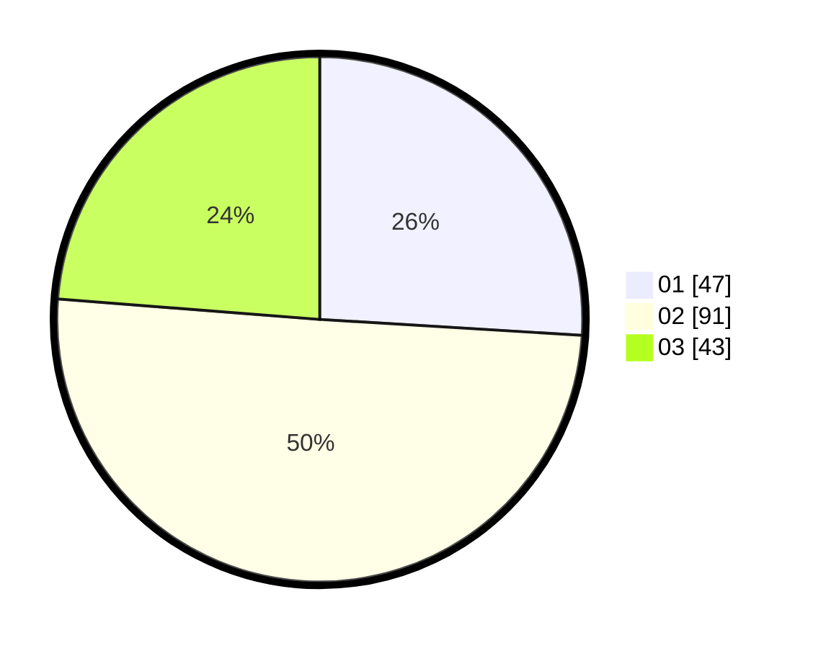

# Hasil

Hasil perolehan suara paslon dapat dilihat pada file paslon-01.txt, paslon-02.txt, dan paslon-03.txt.

Jika tidak ada, artinya data tersebut belum ada pada SIREKAP.

## Perolehan Suara

 * Paslon 01: **47**.
 * Paslon 02: **91**.
 * Paslon 03: **43**.

## Foto C Plano

https://sirekap-obj-formc.kpu.go.id/db36/pemilu/ppwp/31/74/03/10/03/3174031003084-20240216-021909--33c3bf53-0877-40d3-b5e6-14d22fbd2415.jpg

https://sirekap-obj-formc.kpu.go.id/db36/pemilu/ppwp/31/74/03/10/03/3174031003084-20240216-021910--b1d17269-72e8-48b6-9b8d-b3d359d1ffbe.jpg

https://sirekap-obj-formc.kpu.go.id/db36/pemilu/ppwp/31/74/03/10/03/3174031003084-20240216-021909--c5559fb1-192d-4fcd-a459-ef97f13a0365.jpg

## DATA PEMILIH TETAP

Jumlah pemilih dalam DPT: **223**.
 * L: **119**.
 * P: **104**.

## DATA PENGGUNA HAK PILIH

Jumlah pengguna hak pilih dalam DPT: **177**.
 * L: **91**.
 * P: **86**.

Jumlah pengguna hak pilih dalam DPTb: **4**.
 * L: **1**.
 * P: **3**.

Jumlah pengguna hak pilih dalam DPK: **4**.
 * L: **1**.
 * P: **3**.

Jumlah pengguna hak pilih: **185**.
 * L: **93**.
 * P: **92**.

## JUMLAH SUARA SAH DAN TIDAK SAH

JUMLAH SELURUH SUARA SAH: **181**.

JUMLAH SUARA TIDAK SAH: **4**.

JUMLAH SELURUH SUARA SAH DAN SUARA TIDAK SAH: **185**.
