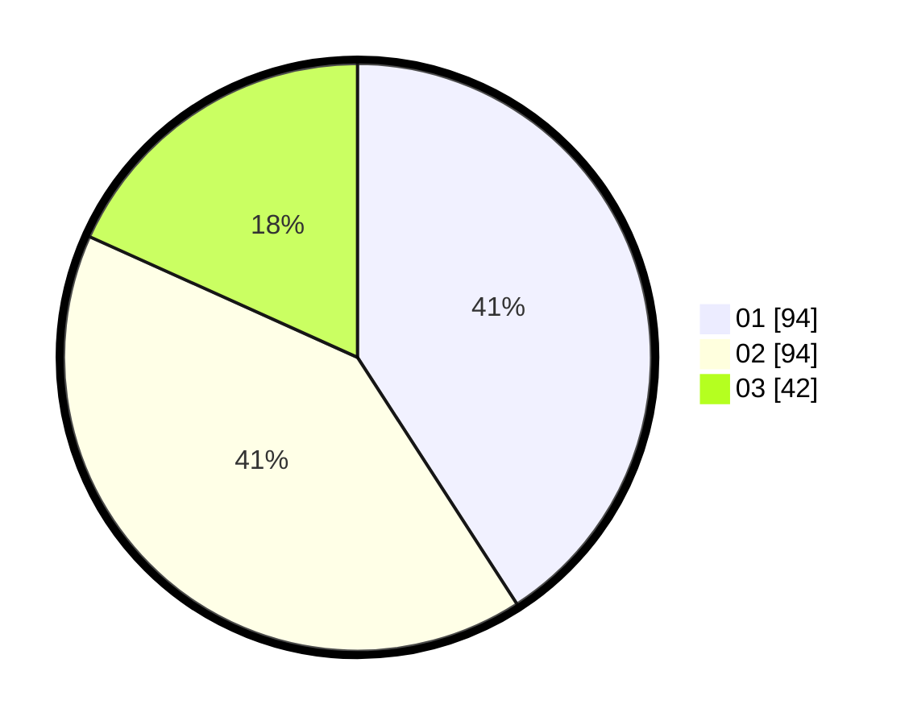

# Hasil

Hasil perolehan suara paslon dapat dilihat pada file paslon-01.txt, paslon-02.txt, dan paslon-03.txt.

Jika tidak ada, artinya data tersebut belum ada pada SIREKAP.

## Perolehan Suara

 * Paslon 01: **94**.
 * Paslon 02: **94**.
 * Paslon 03: **42**.

## Foto C Plano

https://sirekap-obj-formc.kpu.go.id/a8c4/pemilu/ppwp/31/74/03/10/03/3174031003093-20240216-133730--15e5a4cb-50b2-493c-a3e3-dc7932154cb2.jpg

https://sirekap-obj-formc.kpu.go.id/a8c4/pemilu/ppwp/31/74/03/10/03/3174031003093-20240216-133732--cb325a72-9b26-4ff3-b92d-005af4972d9b.jpg

https://sirekap-obj-formc.kpu.go.id/a8c4/pemilu/ppwp/31/74/03/10/03/3174031003093-20240216-133731--f7b72ca3-662f-4639-8a82-55a9f66e1eaa.jpg

## DATA PEMILIH TETAP

Jumlah pemilih dalam DPT: **0**.
 * L: **0**.
 * P: **0**.

## DATA PENGGUNA HAK PILIH

Jumlah pengguna hak pilih dalam DPT: **0**.
 * L: **0**.
 * P: **0**.

Jumlah pengguna hak pilih dalam DPTb: **0**.
 * L: **0**.
 * P: **0**.

Jumlah pengguna hak pilih dalam DPK: **0**.
 * L: **0**.
 * P: **0**.

Jumlah pengguna hak pilih: **0**.
 * L: **0**.
 * P: **0**.

## JUMLAH SUARA SAH DAN TIDAK SAH

JUMLAH SELURUH SUARA SAH: **230**.

JUMLAH SUARA TIDAK SAH: **4**.

JUMLAH SELURUH SUARA SAH DAN SUARA TIDAK SAH: **234**.
