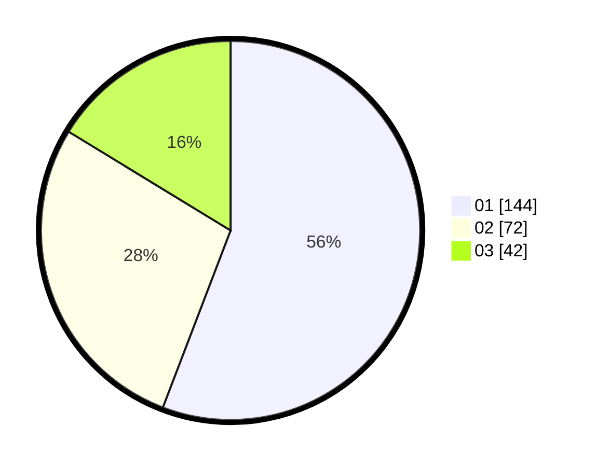

# Hasil

Hasil perolehan suara paslon dapat dilihat pada file paslon-01.txt, paslon-02.txt, dan paslon-03.txt.

Jika tidak ada, artinya data tersebut belum ada pada SIREKAP.

## Perolehan Suara

 * Paslon 01: **144**.
 * Paslon 02: **72**.
 * Paslon 03: **42**.

## Foto C Plano

https://sirekap-obj-formc.kpu.go.id/5300/pemilu/ppwp/31/74/03/10/03/3174031003129-20240214-192738--730b4ba2-7985-4176-a095-3ce0f4352520.jpg

https://sirekap-obj-formc.kpu.go.id/5300/pemilu/ppwp/31/74/03/10/03/3174031003129-20240214-200448--353b8651-0f28-4d46-9f4d-6b21e2a6ef22.jpg

https://sirekap-obj-formc.kpu.go.id/5300/pemilu/ppwp/31/74/03/10/03/3174031003129-20240214-193236--94b17aea-c075-4131-884b-0032b9a4c0c9.jpg

## DATA PEMILIH TETAP

Jumlah pemilih dalam DPT: **424**.
 * L: **314**.
 * P: **414**.

## DATA PENGGUNA HAK PILIH

Jumlah pengguna hak pilih dalam DPT: **258**.
 * L: **126**.
 * P: **172**.

Jumlah pengguna hak pilih dalam DPTb: **4**.
 * L: **0**.
 * P: **0**.

Jumlah pengguna hak pilih dalam DPK: **5**.
 * L: **7**.
 * P: **2**.

Jumlah pengguna hak pilih: **267**.
 * L: **131**.
 * P: **176**.

## JUMLAH SUARA SAH DAN TIDAK SAH

JUMLAH SELURUH SUARA SAH: **258**.

JUMLAH SUARA TIDAK SAH: **0**.

JUMLAH SELURUH SUARA SAH DAN SUARA TIDAK SAH: **258**.
