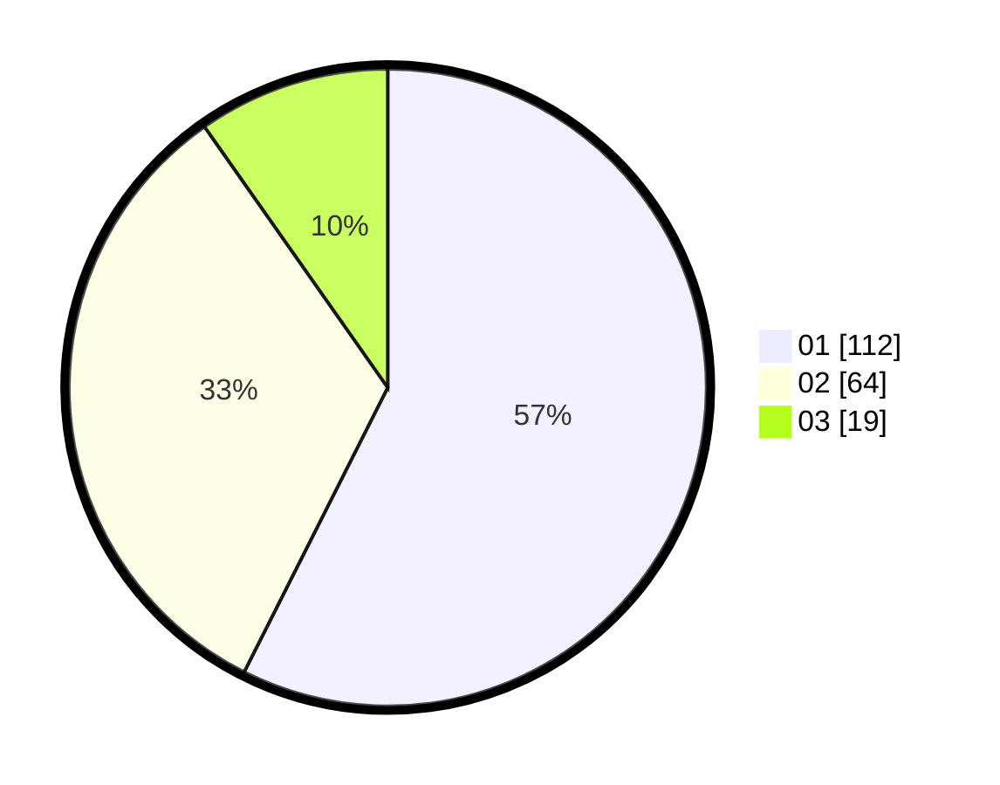

# Hasil

Hasil perolehan suara paslon dapat dilihat pada file paslon-01.txt, paslon-02.txt, dan paslon-03.txt.

Jika tidak ada, artinya data tersebut belum ada pada SIREKAP.

## Perolehan Suara

 * Paslon 01: **112**.
 * Paslon 02: **64**.
 * Paslon 03: **19**.

## Foto C Plano

https://sirekap-obj-formc.kpu.go.id/9118/pemilu/ppwp/31/74/03/10/03/3174031003136-20240215-231801--f6d0a331-30ff-47c9-a0f9-b70dafebd182.jpg

https://sirekap-obj-formc.kpu.go.id/9118/pemilu/ppwp/31/74/03/10/03/3174031003136-20240215-231807--9dca2b2e-9b63-418f-889b-d69805ff9b99.jpg

https://sirekap-obj-formc.kpu.go.id/9118/pemilu/ppwp/31/74/03/10/03/3174031003136-20240215-231806--cb21f0bf-4296-4ce8-a79b-18cdb6cecc38.jpg

## DATA PEMILIH TETAP

Jumlah pemilih dalam DPT: **0**.
 * L: **0**.
 * P: **0**.

## DATA PENGGUNA HAK PILIH

Jumlah pengguna hak pilih dalam DPT: **0**.
 * L: **0**.
 * P: **0**.

Jumlah pengguna hak pilih dalam DPTb: **0**.
 * L: **0**.
 * P: **0**.

Jumlah pengguna hak pilih dalam DPK: **0**.
 * L: **0**.
 * P: **0**.

Jumlah pengguna hak pilih: **0**.
 * L: **0**.
 * P: **0**.

## JUMLAH SUARA SAH DAN TIDAK SAH

JUMLAH SELURUH SUARA SAH: **195**.

JUMLAH SUARA TIDAK SAH: **1**.

JUMLAH SELURUH SUARA SAH DAN SUARA TIDAK SAH: **196**.
