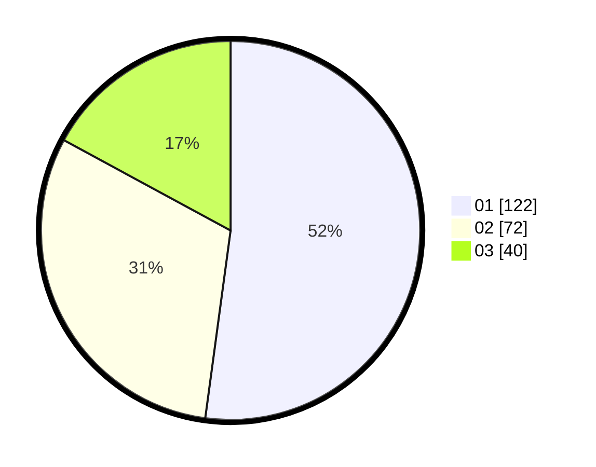

# Hasil

Hasil perolehan suara paslon dapat dilihat pada file paslon-01.txt, paslon-02.txt, dan paslon-03.txt.

Jika tidak ada, artinya data tersebut belum ada pada SIREKAP.

## Perolehan Suara

 * Paslon 01: **122**.
 * Paslon 02: **72**.
 * Paslon 03: **40**.

## Foto C Plano

https://sirekap-obj-formc.kpu.go.id/72fe/pemilu/ppwp/31/74/03/10/03/3174031003139-20240214-185343--b771c630-22ac-4516-b6af-9f83054bfbcc.jpg

https://sirekap-obj-formc.kpu.go.id/72fe/pemilu/ppwp/31/74/03/10/03/3174031003139-20240214-185431--90bbb8e4-dd34-44cb-a7dc-0c55a3377344.jpg

https://sirekap-obj-formc.kpu.go.id/72fe/pemilu/ppwp/31/74/03/10/03/3174031003139-20240214-185447--0bb56726-f16b-4f0c-b635-e757a2bcb2d2.jpg

## DATA PEMILIH TETAP

Jumlah pemilih dalam DPT: **264**.
 * L: **132**.
 * P: **132**.

## DATA PENGGUNA HAK PILIH

Jumlah pengguna hak pilih dalam DPT: **232**.
 * L: **112**.
 * P: **120**.

Jumlah pengguna hak pilih dalam DPTb: **0**.
 * L: **0**.
 * P: **0**.

Jumlah pengguna hak pilih dalam DPK: **6**.
 * L: **3**.
 * P: **3**.

Jumlah pengguna hak pilih: **238**.
 * L: **115**.
 * P: **123**.

## JUMLAH SUARA SAH DAN TIDAK SAH

JUMLAH SELURUH SUARA SAH: **234**.

JUMLAH SUARA TIDAK SAH: **4**.

JUMLAH SELURUH SUARA SAH DAN SUARA TIDAK SAH: **238**.
