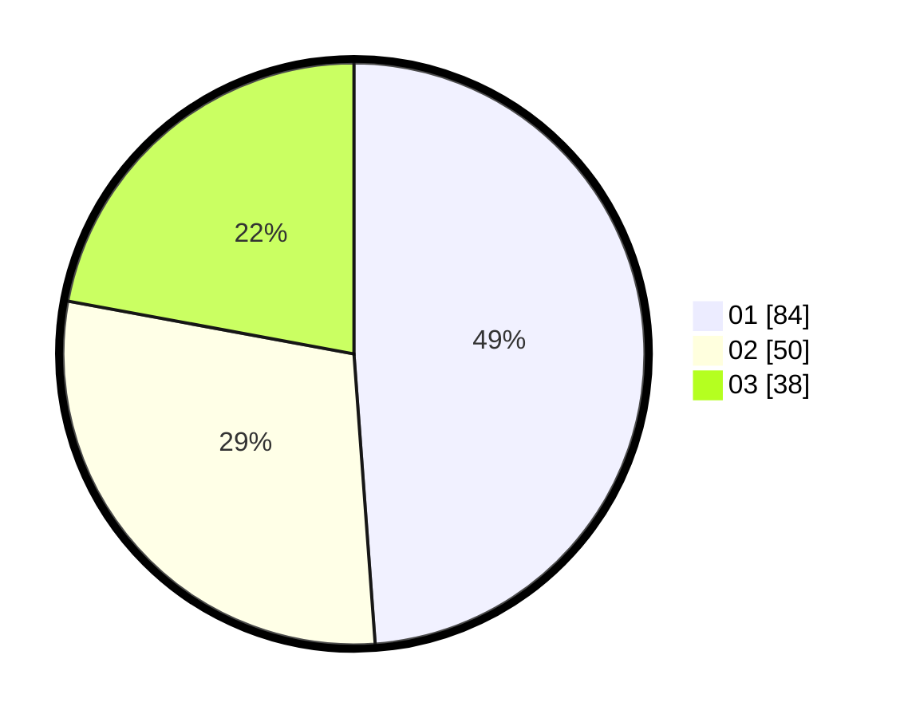

# Hasil

Hasil perolehan suara paslon dapat dilihat pada file paslon-01.txt, paslon-02.txt, dan paslon-03.txt.

Jika tidak ada, artinya data tersebut belum ada pada SIREKAP.

## Perolehan Suara

 * Paslon 01: **84**.
 * Paslon 02: **50**.
 * Paslon 03: **38**.

## Foto C Plano

https://sirekap-obj-formc.kpu.go.id/3786/pemilu/ppwp/31/74/03/10/03/3174031003145-20240215-225101--2f351120-de28-4f6c-a109-9cbf190c371f.jpg

https://sirekap-obj-formc.kpu.go.id/3786/pemilu/ppwp/31/74/03/10/03/3174031003145-20240215-225103--80db377d-dfb9-4de4-9c3e-1d0360158e0e.jpg

https://sirekap-obj-formc.kpu.go.id/3786/pemilu/ppwp/31/74/03/10/03/3174031003145-20240215-225102--ec7fde37-b15e-464e-adf9-8e436e7f2a89.jpg

## DATA PEMILIH TETAP

Jumlah pemilih dalam DPT: **0**.
 * L: **0**.
 * P: **0**.

## DATA PENGGUNA HAK PILIH

Jumlah pengguna hak pilih dalam DPT: **0**.
 * L: **0**.
 * P: **0**.

Jumlah pengguna hak pilih dalam DPTb: **0**.
 * L: **0**.
 * P: **0**.

Jumlah pengguna hak pilih dalam DPK: **0**.
 * L: **0**.
 * P: **0**.

Jumlah pengguna hak pilih: **0**.
 * L: **0**.
 * P: **0**.

## JUMLAH SUARA SAH DAN TIDAK SAH

JUMLAH SELURUH SUARA SAH: **172**.

JUMLAH SUARA TIDAK SAH: **5**.

JUMLAH SELURUH SUARA SAH DAN SUARA TIDAK SAH: **177**.
