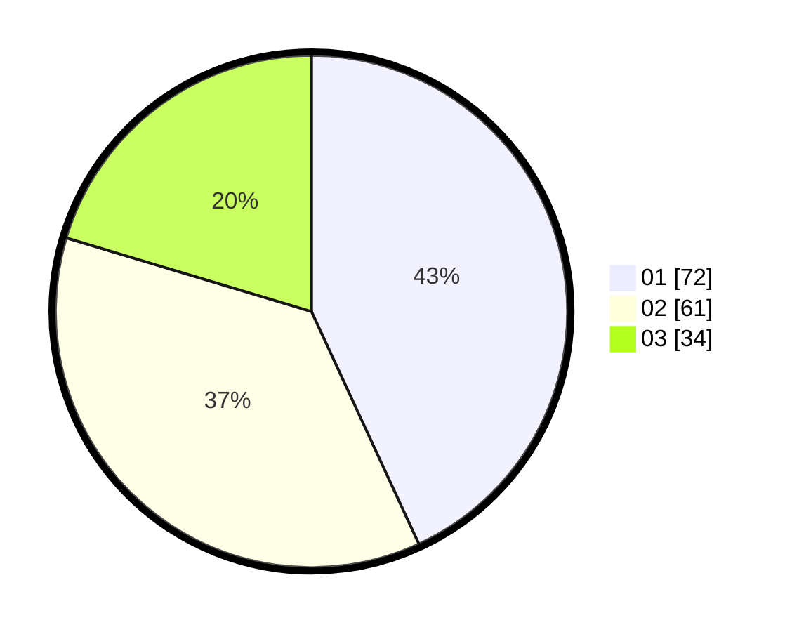

# Hasil

Hasil perolehan suara paslon dapat dilihat pada file paslon-01.txt, paslon-02.txt, dan paslon-03.txt.

Jika tidak ada, artinya data tersebut belum ada pada SIREKAP.

## Perolehan Suara

 * Paslon 01: **72**.
 * Paslon 02: **61**.
 * Paslon 03: **34**.

## Foto C Plano

https://sirekap-obj-formc.kpu.go.id/c0ce/pemilu/ppwp/31/74/03/10/03/3174031003154-20240214-184930--19a6e558-8719-43a8-9ce9-57154287ff67.jpg

https://sirekap-obj-formc.kpu.go.id/c0ce/pemilu/ppwp/31/74/03/10/03/3174031003154-20240214-184957--c6668cd3-954b-42bf-b14b-6ba55ffbf4de.jpg
