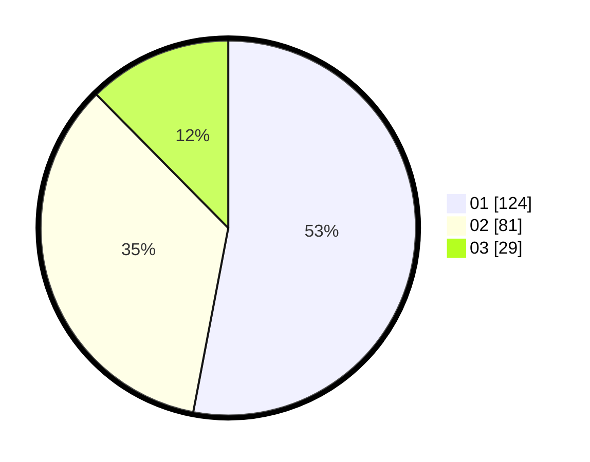

# Hasil

Hasil perolehan suara paslon dapat dilihat pada file paslon-01.txt, paslon-02.txt, dan paslon-03.txt.

Jika tidak ada, artinya data tersebut belum ada pada SIREKAP.

## Perolehan Suara

 * Paslon 01: **124**.
 * Paslon 02: **81**.
 * Paslon 03: **29**.

## Foto C Plano

https://sirekap-obj-formc.kpu.go.id/2255/pemilu/ppwp/31/74/03/10/04/3174031004003-20240215-110917--bc889c9c-71d5-4c8e-98df-f84edd06b386.jpg

https://sirekap-obj-formc.kpu.go.id/2255/pemilu/ppwp/31/74/03/10/04/3174031004003-20240216-010606--0cf9f738-5d23-46c3-b2fa-2c528d168b95.jpg

https://sirekap-obj-formc.kpu.go.id/2255/pemilu/ppwp/31/74/03/10/04/3174031004003-20240215-110935--47c697d1-cdab-476f-ba19-962b983473ed.jpg

## DATA PEMILIH TETAP

Jumlah pemilih dalam DPT: **272**.
 * L: **135**.
 * P: **137**.

## DATA PENGGUNA HAK PILIH

Jumlah pengguna hak pilih dalam DPT: **225**.
 * L: **110**.
 * P: **115**.

Jumlah pengguna hak pilih dalam DPTb: **14**.
 * L: **9**.
 * P: **5**.

Jumlah pengguna hak pilih dalam DPK: **0**.
 * L: **0**.
 * P: **0**.

Jumlah pengguna hak pilih: **239**.
 * L: **119**.
 * P: **120**.

## JUMLAH SUARA SAH DAN TIDAK SAH

JUMLAH SELURUH SUARA SAH: **234**.

JUMLAH SUARA TIDAK SAH: **5**.

JUMLAH SELURUH SUARA SAH DAN SUARA TIDAK SAH: **239**.
