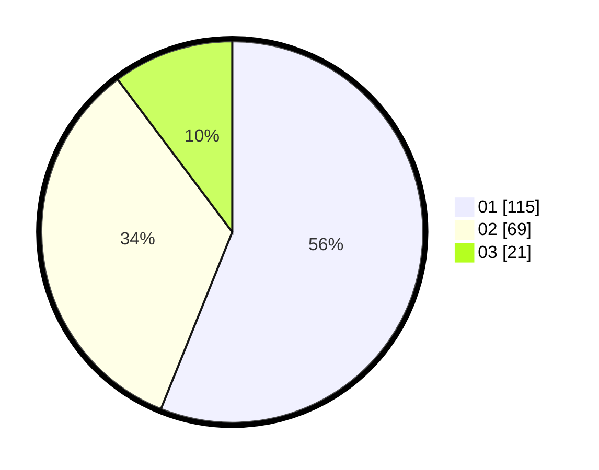

# Hasil

Hasil perolehan suara paslon dapat dilihat pada file paslon-01.txt, paslon-02.txt, dan paslon-03.txt.

Jika tidak ada, artinya data tersebut belum ada pada SIREKAP.

## Perolehan Suara

 * Paslon 01: **115**.
 * Paslon 02: **69**.
 * Paslon 03: **21**.

## Foto C Plano

https://sirekap-obj-formc.kpu.go.id/8b0e/pemilu/ppwp/31/74/03/10/04/3174031004004-20240216-053244--6b0c9359-479a-4d1e-b7c4-cfa9a0db20e9.jpg

https://sirekap-obj-formc.kpu.go.id/8b0e/pemilu/ppwp/31/74/03/10/04/3174031004004-20240216-015208--d0c4bada-21ac-4534-91e9-d849c6baaf93.jpg

https://sirekap-obj-formc.kpu.go.id/8b0e/pemilu/ppwp/31/74/03/10/04/3174031004004-20240216-015203--7c03e2fc-c5e4-42cc-a83b-ca4fee17ba10.jpg

## DATA PEMILIH TETAP

Jumlah pemilih dalam DPT: **251**.
 * L: **122**.
 * P: **129**.

## DATA PENGGUNA HAK PILIH

Jumlah pengguna hak pilih dalam DPT: **198**.
 * L: **92**.
 * P: **106**.

Jumlah pengguna hak pilih dalam DPTb: **7**.
 * L: **4**.
 * P: **3**.

Jumlah pengguna hak pilih dalam DPK: **0**.
 * L: **0**.
 * P: **0**.

Jumlah pengguna hak pilih: **205**.
 * L: **96**.
 * P: **109**.

## JUMLAH SUARA SAH DAN TIDAK SAH

JUMLAH SELURUH SUARA SAH: **205**.

JUMLAH SUARA TIDAK SAH: **0**.

JUMLAH SELURUH SUARA SAH DAN SUARA TIDAK SAH: **205**.
