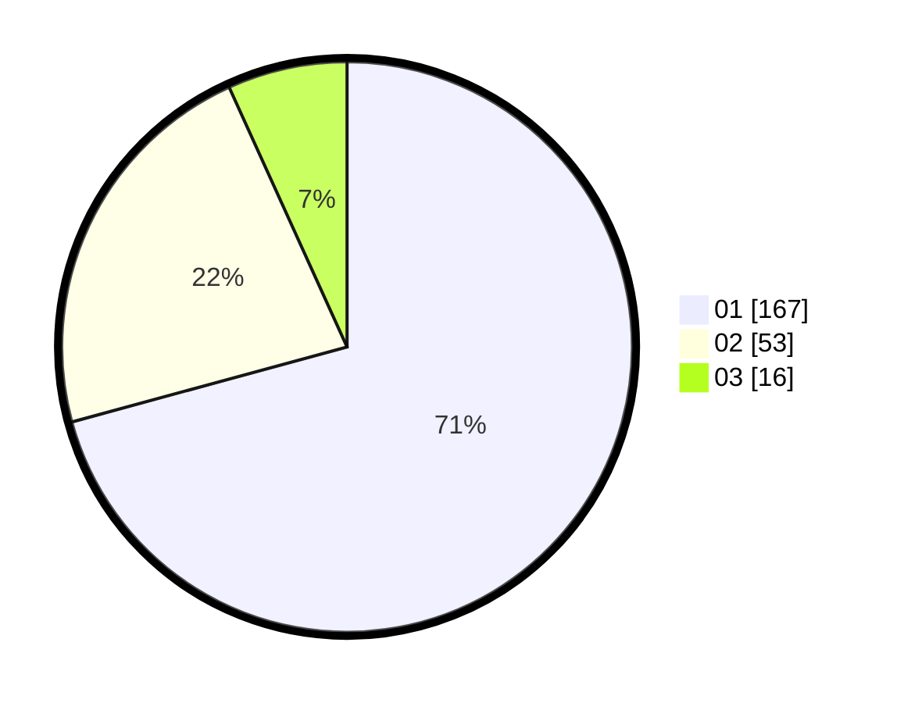

# Hasil

Hasil perolehan suara paslon dapat dilihat pada file paslon-01.txt, paslon-02.txt, dan paslon-03.txt.

Jika tidak ada, artinya data tersebut belum ada pada SIREKAP.

## Perolehan Suara

 * Paslon 01: **167**.
 * Paslon 02: **53**.
 * Paslon 03: **16**.

## Foto C Plano

https://sirekap-obj-formc.kpu.go.id/7d97/pemilu/ppwp/31/74/03/10/04/3174031004009-20240215-235459--a0b78652-2cb9-43c7-9184-4f7a86058f0a.jpg

https://sirekap-obj-formc.kpu.go.id/7d97/pemilu/ppwp/31/74/03/10/04/3174031004009-20240215-235503--575d6932-b91b-4439-b66f-302ebe97ce97.jpg

https://sirekap-obj-formc.kpu.go.id/7d97/pemilu/ppwp/31/74/03/10/04/3174031004009-20240215-235502--2815f62f-6a82-44fa-954e-79c8b439f6d8.jpg

## DATA PEMILIH TETAP

Jumlah pemilih dalam DPT: **260**.
 * L: **127**.
 * P: **133**.

## DATA PENGGUNA HAK PILIH

Jumlah pengguna hak pilih dalam DPT: **222**.
 * L: **110**.
 * P: **112**.

Jumlah pengguna hak pilih dalam DPTb: **10**.
 * L: **2**.
 * P: **8**.

Jumlah pengguna hak pilih dalam DPK: **4**.
 * L: **3**.
 * P: **1**.

Jumlah pengguna hak pilih: **236**.
 * L: **115**.
 * P: **121**.

## JUMLAH SUARA SAH DAN TIDAK SAH

JUMLAH SELURUH SUARA SAH: **236**.

JUMLAH SUARA TIDAK SAH: **0**.

JUMLAH SELURUH SUARA SAH DAN SUARA TIDAK SAH: **236**.
