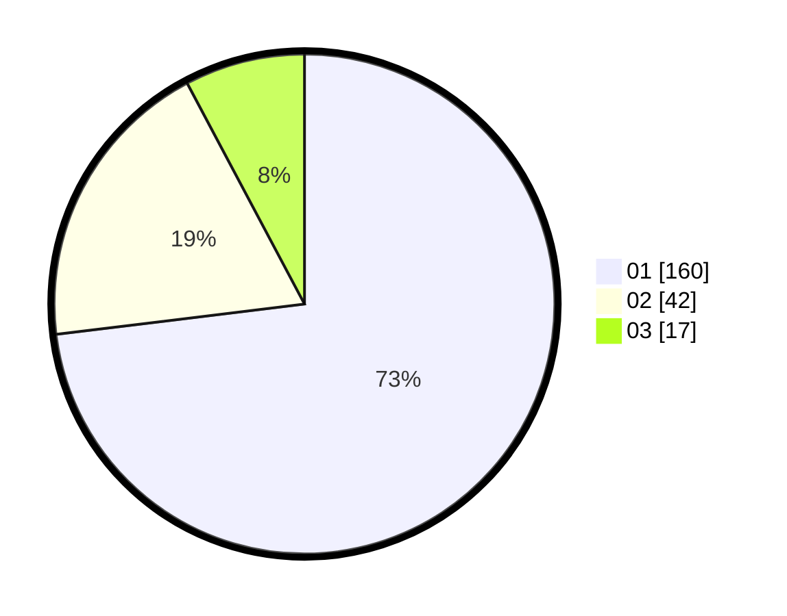

# Hasil

Hasil perolehan suara paslon dapat dilihat pada file paslon-01.txt, paslon-02.txt, dan paslon-03.txt.

Jika tidak ada, artinya data tersebut belum ada pada SIREKAP.

## Perolehan Suara

 * Paslon 01: **160**.
 * Paslon 02: **42**.
 * Paslon 03: **17**.

## Foto C Plano

https://sirekap-obj-formc.kpu.go.id/02df/pemilu/ppwp/31/74/03/10/04/3174031004013-20240216-121549--4c1c5752-78fd-42ac-a57a-f658099c9929.jpg

https://sirekap-obj-formc.kpu.go.id/02df/pemilu/ppwp/31/74/03/10/04/3174031004013-20240216-121553--fbbc8aa1-c584-43e8-90b9-53aa8d39023c.jpg

https://sirekap-obj-formc.kpu.go.id/02df/pemilu/ppwp/31/74/03/10/04/3174031004013-20240216-121551--7af21529-0417-4b76-943a-e9739c807465.jpg

## DATA PEMILIH TETAP

Jumlah pemilih dalam DPT: **253**.
 * L: **126**.
 * P: **127**.

## DATA PENGGUNA HAK PILIH

Jumlah pengguna hak pilih dalam DPT: **209**.
 * L: **102**.
 * P: **107**.

Jumlah pengguna hak pilih dalam DPTb: **9**.
 * L: **6**.
 * P: **3**.

Jumlah pengguna hak pilih dalam DPK: **2**.
 * L: **2**.
 * P: **0**.

Jumlah pengguna hak pilih: **220**.
 * L: **110**.
 * P: **110**.

## JUMLAH SUARA SAH DAN TIDAK SAH

JUMLAH SELURUH SUARA SAH: **219**.

JUMLAH SUARA TIDAK SAH: **1**.

JUMLAH SELURUH SUARA SAH DAN SUARA TIDAK SAH: **220**.
