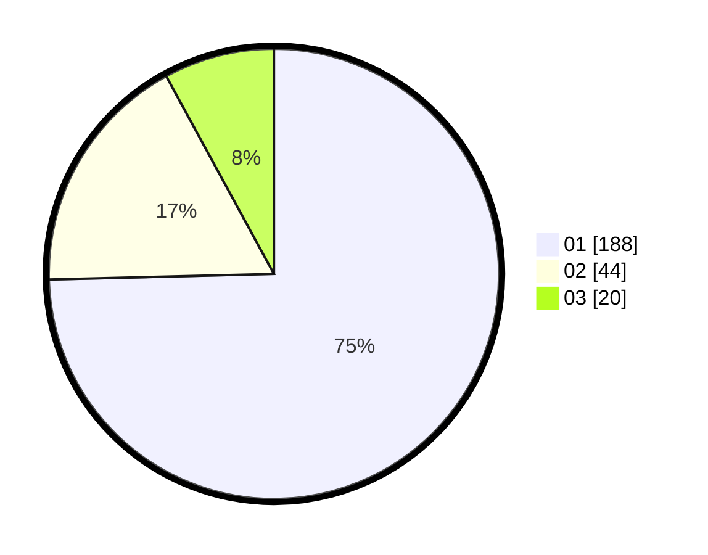

# Hasil

Hasil perolehan suara paslon dapat dilihat pada file paslon-01.txt, paslon-02.txt, dan paslon-03.txt.

Jika tidak ada, artinya data tersebut belum ada pada SIREKAP.

## Perolehan Suara

 * Paslon 01: **188**.
 * Paslon 02: **44**.
 * Paslon 03: **20**.

## Foto C Plano

https://sirekap-obj-formc.kpu.go.id/6a0e/pemilu/ppwp/31/74/03/10/04/3174031004019-20240216-033835--1e9750f0-b0f2-4926-8a9e-6c3b79642508.jpg

https://sirekap-obj-formc.kpu.go.id/6a0e/pemilu/ppwp/31/74/03/10/04/3174031004019-20240216-033836--f8cfe9ed-2af7-4c06-9942-00a99e6041dd.jpg

https://sirekap-obj-formc.kpu.go.id/6a0e/pemilu/ppwp/31/74/03/10/04/3174031004019-20240216-033836--b4a38b7b-fba1-4539-997f-3501e71dcb86.jpg

## DATA PEMILIH TETAP

Jumlah pemilih dalam DPT: **292**.
 * L: **144**.
 * P: **148**.

## DATA PENGGUNA HAK PILIH

Jumlah pengguna hak pilih dalam DPT: **243**.
 * L: **113**.
 * P: **130**.

Jumlah pengguna hak pilih dalam DPTb: **8**.
 * L: **5**.
 * P: **3**.

Jumlah pengguna hak pilih dalam DPK: **1**.
 * L: **1**.
 * P: **0**.

Jumlah pengguna hak pilih: **252**.
 * L: **119**.
 * P: **133**.

## JUMLAH SUARA SAH DAN TIDAK SAH

JUMLAH SELURUH SUARA SAH: **252**.

JUMLAH SUARA TIDAK SAH: **0**.

JUMLAH SELURUH SUARA SAH DAN SUARA TIDAK SAH: **252**.
