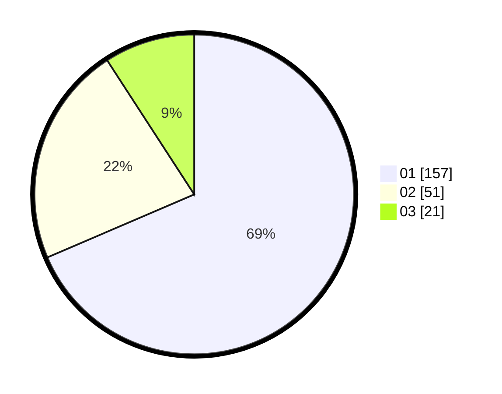

# Hasil

Hasil perolehan suara paslon dapat dilihat pada file paslon-01.txt, paslon-02.txt, dan paslon-03.txt.

Jika tidak ada, artinya data tersebut belum ada pada SIREKAP.

## Perolehan Suara

 * Paslon 01: **157**.
 * Paslon 02: **51**.
 * Paslon 03: **21**.

## Foto C Plano

https://sirekap-obj-formc.kpu.go.id/e537/pemilu/ppwp/31/74/03/10/04/3174031004021-20240216-063614--bd560e78-e2bf-4dce-bad1-aeb7dc7b7d95.jpg

https://sirekap-obj-formc.kpu.go.id/e537/pemilu/ppwp/31/74/03/10/04/3174031004021-20240216-063625--ae724be5-cdfc-446b-bb98-df4fce26ac31.jpg

https://sirekap-obj-formc.kpu.go.id/e537/pemilu/ppwp/31/74/03/10/04/3174031004021-20240216-063620--ceb383e9-49f1-4914-8225-ede918e85541.jpg

## DATA PEMILIH TETAP

Jumlah pemilih dalam DPT: **290**.
 * L: **154**.
 * P: **136**.

## DATA PENGGUNA HAK PILIH

Jumlah pengguna hak pilih dalam DPT: **224**.
 * L: **108**.
 * P: **116**.

Jumlah pengguna hak pilih dalam DPTb: **5**.
 * L: **1**.
 * P: **4**.

Jumlah pengguna hak pilih dalam DPK: **3**.
 * L: **1**.
 * P: **2**.

Jumlah pengguna hak pilih: **232**.
 * L: **110**.
 * P: **122**.

## JUMLAH SUARA SAH DAN TIDAK SAH

JUMLAH SELURUH SUARA SAH: **229**.

JUMLAH SUARA TIDAK SAH: **3**.

JUMLAH SELURUH SUARA SAH DAN SUARA TIDAK SAH: **232**.
