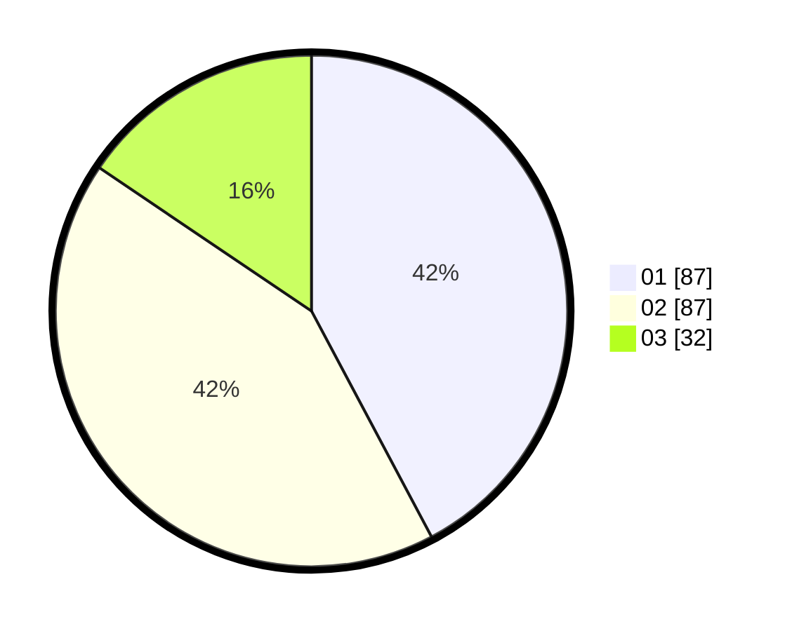

# Hasil

Hasil perolehan suara paslon dapat dilihat pada file paslon-01.txt, paslon-02.txt, dan paslon-03.txt.

Jika tidak ada, artinya data tersebut belum ada pada SIREKAP.

## Perolehan Suara

 * Paslon 01: **87**.
 * Paslon 02: **87**.
 * Paslon 03: **32**.

## Foto C Plano

https://sirekap-obj-formc.kpu.go.id/8b15/pemilu/ppwp/31/74/03/10/04/3174031004035-20240216-073247--bb694083-7f4b-4ff0-8b06-ed6cb3767289.jpg

https://sirekap-obj-formc.kpu.go.id/8b15/pemilu/ppwp/31/74/03/10/04/3174031004035-20240216-073249--765addb2-7398-43bd-8218-b84647e5288b.jpg

https://sirekap-obj-formc.kpu.go.id/8b15/pemilu/ppwp/31/74/03/10/04/3174031004035-20240216-073248--c8361ae2-5882-4620-ad4f-7dfb832b787c.jpg

## DATA PEMILIH TETAP

Jumlah pemilih dalam DPT: **270**.
 * L: **145**.
 * P: **125**.

## DATA PENGGUNA HAK PILIH

Jumlah pengguna hak pilih dalam DPT: **208**.
 * L: **105**.
 * P: **103**.

Jumlah pengguna hak pilih dalam DPTb: **4**.
 * L: **0**.
 * P: **4**.

Jumlah pengguna hak pilih dalam DPK: **0**.
 * L: **0**.
 * P: **0**.

Jumlah pengguna hak pilih: **212**.
 * L: **105**.
 * P: **107**.

## JUMLAH SUARA SAH DAN TIDAK SAH

JUMLAH SELURUH SUARA SAH: **206**.

JUMLAH SUARA TIDAK SAH: **1**.

JUMLAH SELURUH SUARA SAH DAN SUARA TIDAK SAH: **207**.
