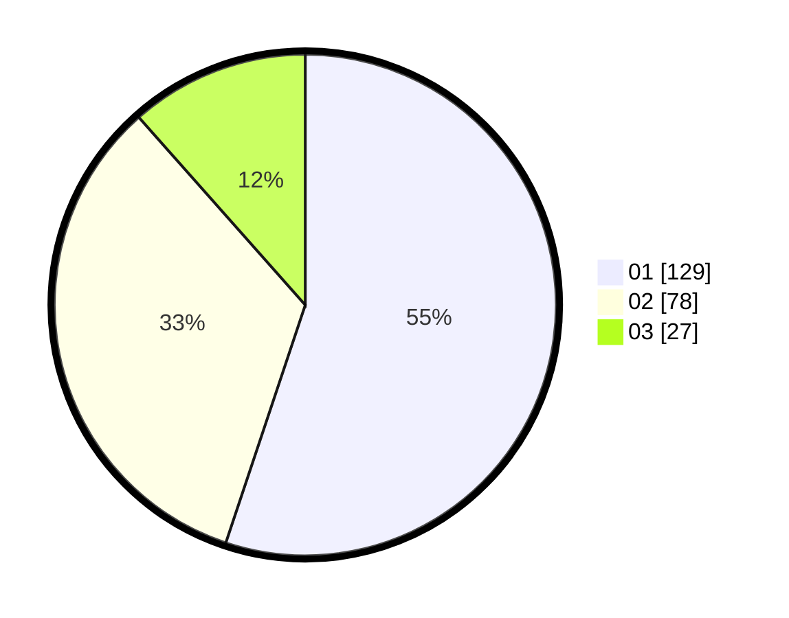

# Hasil

Hasil perolehan suara paslon dapat dilihat pada file paslon-01.txt, paslon-02.txt, dan paslon-03.txt.

Jika tidak ada, artinya data tersebut belum ada pada SIREKAP.

## Perolehan Suara

 * Paslon 01: **129**.
 * Paslon 02: **78**.
 * Paslon 03: **27**.

## Foto C Plano

https://sirekap-obj-formc.kpu.go.id/0d7e/pemilu/ppwp/31/74/03/10/04/3174031004039-20240216-040443--fe8a6185-4f3b-48ee-ae47-20e9041a06b3.jpg

https://sirekap-obj-formc.kpu.go.id/0d7e/pemilu/ppwp/31/74/03/10/04/3174031004039-20240216-040449--ad5c449f-0964-4d6b-a7f4-2b564709e3bc.jpg

https://sirekap-obj-formc.kpu.go.id/0d7e/pemilu/ppwp/31/74/03/10/04/3174031004039-20240216-040448--5a25990d-489b-420a-9693-c8c9d88af0ef.jpg

## DATA PEMILIH TETAP

Jumlah pemilih dalam DPT: **293**.
 * L: **153**.
 * P: **140**.

## DATA PENGGUNA HAK PILIH

Jumlah pengguna hak pilih dalam DPT: **226**.
 * L: **112**.
 * P: **114**.

Jumlah pengguna hak pilih dalam DPTb: **10**.
 * L: **2**.
 * P: **8**.

Jumlah pengguna hak pilih dalam DPK: **0**.
 * L: **0**.
 * P: **0**.

Jumlah pengguna hak pilih: **236**.
 * L: **114**.
 * P: **122**.

## JUMLAH SUARA SAH DAN TIDAK SAH

JUMLAH SELURUH SUARA SAH: **234**.

JUMLAH SUARA TIDAK SAH: **2**.

JUMLAH SELURUH SUARA SAH DAN SUARA TIDAK SAH: **236**.
