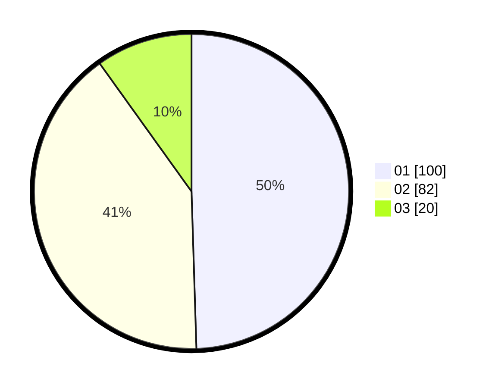

# Hasil

Hasil perolehan suara paslon dapat dilihat pada file paslon-01.txt, paslon-02.txt, dan paslon-03.txt.

Jika tidak ada, artinya data tersebut belum ada pada SIREKAP.

## Perolehan Suara

 * Paslon 01: **100**.
 * Paslon 02: **82**.
 * Paslon 03: **20**.

## Foto C Plano

https://sirekap-obj-formc.kpu.go.id/2019/pemilu/ppwp/31/74/03/10/04/3174031004040-20240215-225031--bbcb26b7-2b9b-420c-992d-21f5b56564f8.jpg

https://sirekap-obj-formc.kpu.go.id/2019/pemilu/ppwp/31/74/03/10/04/3174031004040-20240215-225034--34b32b8b-ade0-4369-a314-1d16eeccd4eb.jpg

https://sirekap-obj-formc.kpu.go.id/2019/pemilu/ppwp/31/74/03/10/04/3174031004040-20240215-225033--67539c37-b088-498f-b6e5-b5be07376050.jpg

## DATA PEMILIH TETAP

Jumlah pemilih dalam DPT: **299**.
 * L: **148**.
 * P: **151**.

## DATA PENGGUNA HAK PILIH

Jumlah pengguna hak pilih dalam DPT: **192**.
 * L: **91**.
 * P: **101**.

Jumlah pengguna hak pilih dalam DPTb: **6**.
 * L: **1**.
 * P: **5**.

Jumlah pengguna hak pilih dalam DPK: **6**.
 * L: **2**.
 * P: **4**.

Jumlah pengguna hak pilih: **204**.
 * L: **94**.
 * P: **110**.

## JUMLAH SUARA SAH DAN TIDAK SAH

JUMLAH SELURUH SUARA SAH: **202**.

JUMLAH SUARA TIDAK SAH: **2**.

JUMLAH SELURUH SUARA SAH DAN SUARA TIDAK SAH: **204**.
