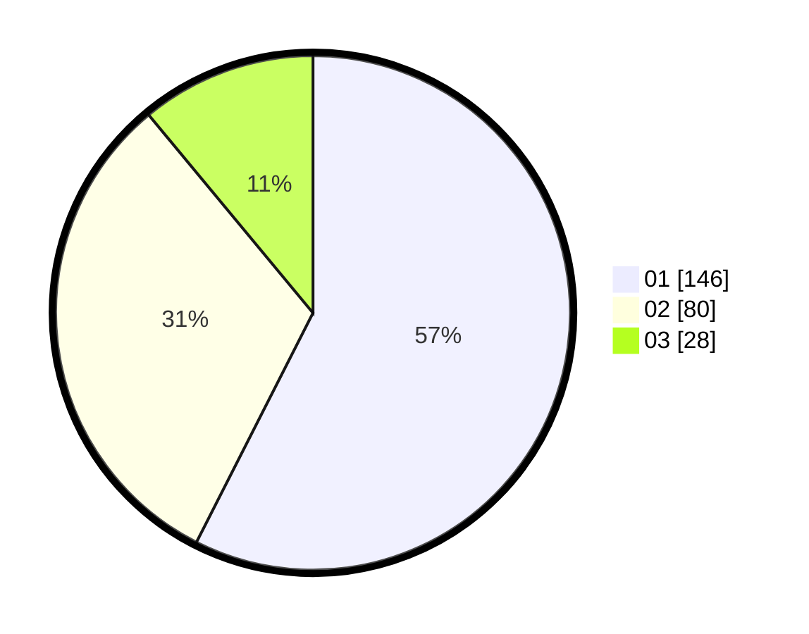

# Hasil

Hasil perolehan suara paslon dapat dilihat pada file paslon-01.txt, paslon-02.txt, dan paslon-03.txt.

Jika tidak ada, artinya data tersebut belum ada pada SIREKAP.

## Perolehan Suara

 * Paslon 01: **146**.
 * Paslon 02: **80**.
 * Paslon 03: **28**.

## Foto C Plano

https://sirekap-obj-formc.kpu.go.id/e076/pemilu/ppwp/31/74/03/10/04/3174031004041-20240216-013045--76194c67-63b0-4917-b132-09f2fd7fea16.jpg

https://sirekap-obj-formc.kpu.go.id/e076/pemilu/ppwp/31/74/03/10/04/3174031004041-20240216-013056--2753c1cf-e083-44ba-8ecd-a82a77766228.jpg

https://sirekap-obj-formc.kpu.go.id/e076/pemilu/ppwp/31/74/03/10/04/3174031004041-20240216-013050--84feadd9-08c1-4ed3-9eba-ed0c741a932f.jpg

## DATA PEMILIH TETAP

Jumlah pemilih dalam DPT: **290**.
 * L: **155**.
 * P: **135**.

## DATA PENGGUNA HAK PILIH

Jumlah pengguna hak pilih dalam DPT: **247**.
 * L: **129**.
 * P: **118**.

Jumlah pengguna hak pilih dalam DPTb: **7**.
 * L: **4**.
 * P: **3**.

Jumlah pengguna hak pilih dalam DPK: **1**.
 * L: **0**.
 * P: **1**.

Jumlah pengguna hak pilih: **255**.
 * L: **133**.
 * P: **122**.

## JUMLAH SUARA SAH DAN TIDAK SAH

JUMLAH SELURUH SUARA SAH: **254**.

JUMLAH SUARA TIDAK SAH: **1**.

JUMLAH SELURUH SUARA SAH DAN SUARA TIDAK SAH: **255**.
