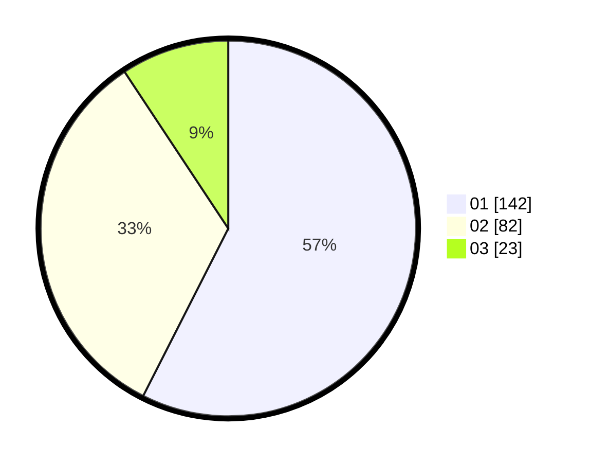

# Hasil

Hasil perolehan suara paslon dapat dilihat pada file paslon-01.txt, paslon-02.txt, dan paslon-03.txt.

Jika tidak ada, artinya data tersebut belum ada pada SIREKAP.

## Perolehan Suara

 * Paslon 01: **142**.
 * Paslon 02: **82**.
 * Paslon 03: **23**.

## Foto C Plano

https://sirekap-obj-formc.kpu.go.id/8c09/pemilu/ppwp/31/74/03/10/04/3174031004043-20240216-011712--efcd49d0-0029-4f9a-8b6d-884fa243e5ae.jpg

https://sirekap-obj-formc.kpu.go.id/8c09/pemilu/ppwp/31/74/03/10/04/3174031004043-20240216-011724--18694392-864c-4007-b0ed-1494b560af29.jpg

https://sirekap-obj-formc.kpu.go.id/8c09/pemilu/ppwp/31/74/03/10/04/3174031004043-20240216-011718--d73f2cee-db38-4bc2-9885-11561f98c5e5.jpg

## DATA PEMILIH TETAP

Jumlah pemilih dalam DPT: **290**.
 * L: **142**.
 * P: **148**.

## DATA PENGGUNA HAK PILIH

Jumlah pengguna hak pilih dalam DPT: **240**.
 * L: **117**.
 * P: **123**.

Jumlah pengguna hak pilih dalam DPTb: **9**.
 * L: **5**.
 * P: **4**.

Jumlah pengguna hak pilih dalam DPK: **1**.
 * L: **0**.
 * P: **1**.

Jumlah pengguna hak pilih: **250**.
 * L: **122**.
 * P: **128**.

## JUMLAH SUARA SAH DAN TIDAK SAH

JUMLAH SELURUH SUARA SAH: **247**.

JUMLAH SUARA TIDAK SAH: **3**.

JUMLAH SELURUH SUARA SAH DAN SUARA TIDAK SAH: **250**.
