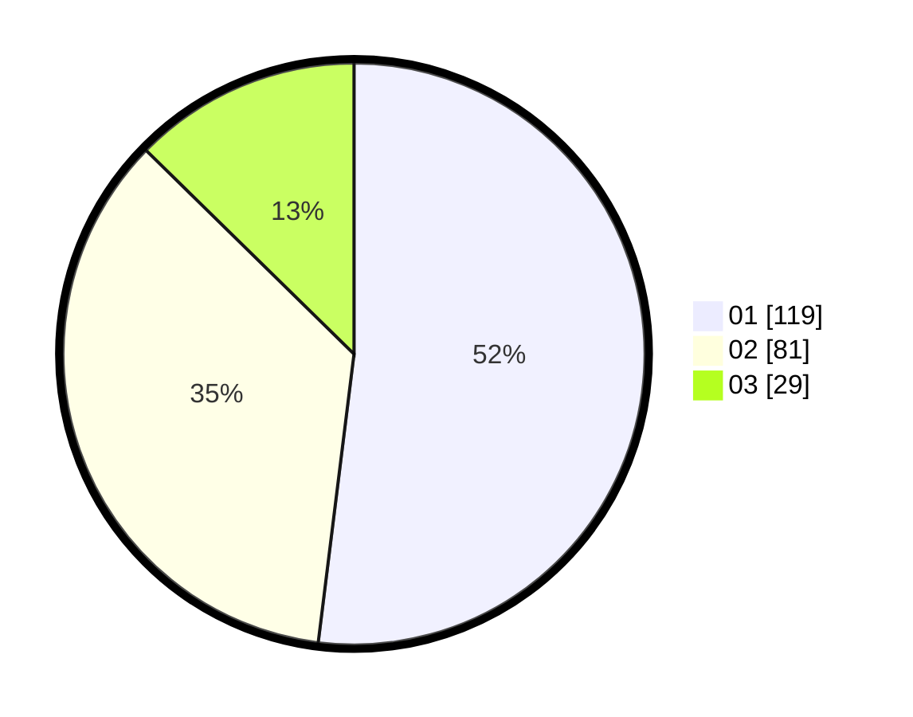

# Hasil

Hasil perolehan suara paslon dapat dilihat pada file paslon-01.txt, paslon-02.txt, dan paslon-03.txt.

Jika tidak ada, artinya data tersebut belum ada pada SIREKAP.

## Perolehan Suara

 * Paslon 01: **119**.
 * Paslon 02: **81**.
 * Paslon 03: **29**.

## Foto C Plano

https://sirekap-obj-formc.kpu.go.id/9f61/pemilu/ppwp/31/74/03/10/04/3174031004049-20240216-190407--9ab7a544-772b-4c6a-b9ab-3a6e08057ec2.jpg

https://sirekap-obj-formc.kpu.go.id/9f61/pemilu/ppwp/31/74/03/10/04/3174031004049-20240216-190409--b86f6455-142a-4709-a23a-ab94e161de2b.jpg

https://sirekap-obj-formc.kpu.go.id/9f61/pemilu/ppwp/31/74/03/10/04/3174031004049-20240216-190408--a3f40033-bc15-4640-86d0-c66da0290f66.jpg

## DATA PEMILIH TETAP

Jumlah pemilih dalam DPT: **290**.
 * L: **152**.
 * P: **138**.

## DATA PENGGUNA HAK PILIH

Jumlah pengguna hak pilih dalam DPT: **221**.
 * L: **105**.
 * P: **116**.

Jumlah pengguna hak pilih dalam DPTb: **8**.
 * L: **4**.
 * P: **4**.

Jumlah pengguna hak pilih dalam DPK: **1**.
 * L: **1**.
 * P: **0**.

Jumlah pengguna hak pilih: **230**.
 * L: **110**.
 * P: **120**.

## JUMLAH SUARA SAH DAN TIDAK SAH

JUMLAH SELURUH SUARA SAH: **229**.

JUMLAH SUARA TIDAK SAH: **1**.

JUMLAH SELURUH SUARA SAH DAN SUARA TIDAK SAH: **230**.
