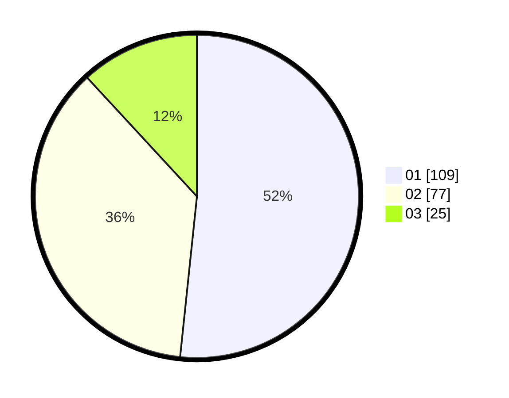

# Hasil

Hasil perolehan suara paslon dapat dilihat pada file paslon-01.txt, paslon-02.txt, dan paslon-03.txt.

Jika tidak ada, artinya data tersebut belum ada pada SIREKAP.

## Perolehan Suara

 * Paslon 01: **109**.
 * Paslon 02: **77**.
 * Paslon 03: **25**.

## Foto C Plano

https://sirekap-obj-formc.kpu.go.id/e2ff/pemilu/ppwp/31/74/03/10/04/3174031004051-20240216-103537--05198585-d848-4e1e-ac0a-554e8dcefdac.jpg

https://sirekap-obj-formc.kpu.go.id/e2ff/pemilu/ppwp/31/74/03/10/04/3174031004051-20240216-103538--e822fe08-36da-4c5c-b366-6f988f9e0ee8.jpg

https://sirekap-obj-formc.kpu.go.id/e2ff/pemilu/ppwp/31/74/03/10/04/3174031004051-20240216-103537--e5d8e774-e200-4573-a2f2-33fa5121cd6f.jpg

## DATA PEMILIH TETAP

Jumlah pemilih dalam DPT: **275**.
 * L: **142**.
 * P: **133**.

## DATA PENGGUNA HAK PILIH

Jumlah pengguna hak pilih dalam DPT: **207**.
 * L: **106**.
 * P: **101**.

Jumlah pengguna hak pilih dalam DPTb: **3**.
 * L: **3**.
 * P: **0**.

Jumlah pengguna hak pilih dalam DPK: **2**.
 * L: **2**.
 * P: **0**.

Jumlah pengguna hak pilih: **212**.
 * L: **111**.
 * P: **101**.

## JUMLAH SUARA SAH DAN TIDAK SAH

JUMLAH SELURUH SUARA SAH: **211**.

JUMLAH SUARA TIDAK SAH: **1**.

JUMLAH SELURUH SUARA SAH DAN SUARA TIDAK SAH: **212**.
