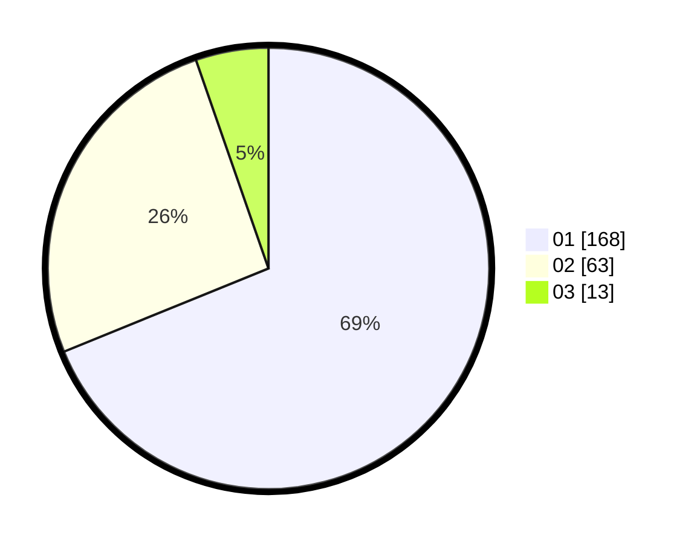

# Hasil

Hasil perolehan suara paslon dapat dilihat pada file paslon-01.txt, paslon-02.txt, dan paslon-03.txt.

Jika tidak ada, artinya data tersebut belum ada pada SIREKAP.

## Perolehan Suara

 * Paslon 01: **168**.
 * Paslon 02: **63**.
 * Paslon 03: **13**.

## Foto C Plano

https://sirekap-obj-formc.kpu.go.id/9061/pemilu/ppwp/31/74/03/10/04/3174031004055-20240216-053121--0bf767a4-e66d-4a2e-8f96-0910cec8fba0.jpg

https://sirekap-obj-formc.kpu.go.id/9061/pemilu/ppwp/31/74/03/10/04/3174031004055-20240216-053123--98e3eb83-6d0b-4d82-9994-57b75fce9e37.jpg

https://sirekap-obj-formc.kpu.go.id/9061/pemilu/ppwp/31/74/03/10/04/3174031004055-20240216-053122--9463d2dd-0d92-4a4f-b982-45b3d8f5a1e2.jpg

## DATA PEMILIH TETAP

Jumlah pemilih dalam DPT: **0**.
 * L: **0**.
 * P: **0**.

## DATA PENGGUNA HAK PILIH

Jumlah pengguna hak pilih dalam DPT: **0**.
 * L: **0**.
 * P: **0**.

Jumlah pengguna hak pilih dalam DPTb: **0**.
 * L: **0**.
 * P: **0**.

Jumlah pengguna hak pilih dalam DPK: **0**.
 * L: **0**.
 * P: **0**.

Jumlah pengguna hak pilih: **0**.
 * L: **0**.
 * P: **0**.

## JUMLAH SUARA SAH DAN TIDAK SAH

JUMLAH SELURUH SUARA SAH: **244**.

JUMLAH SUARA TIDAK SAH: **2**.

JUMLAH SELURUH SUARA SAH DAN SUARA TIDAK SAH: **246**.
