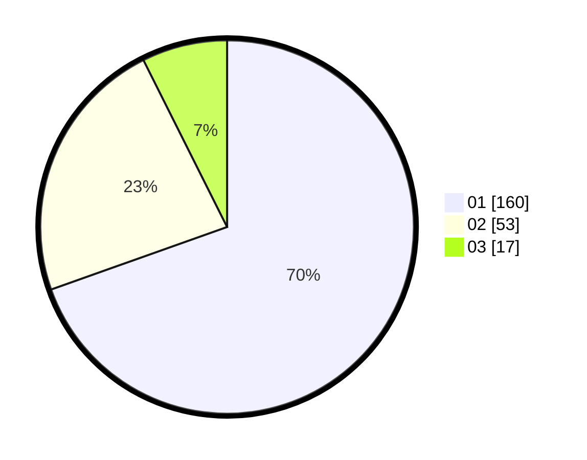

# Hasil

Hasil perolehan suara paslon dapat dilihat pada file paslon-01.txt, paslon-02.txt, dan paslon-03.txt.

Jika tidak ada, artinya data tersebut belum ada pada SIREKAP.

## Perolehan Suara

 * Paslon 01: **160**.
 * Paslon 02: **53**.
 * Paslon 03: **17**.

## Foto C Plano

https://sirekap-obj-formc.kpu.go.id/d414/pemilu/ppwp/31/74/03/10/04/3174031004056-20240215-231933--e4d62383-e201-47b8-9d06-0e613a262c0f.jpg

https://sirekap-obj-formc.kpu.go.id/d414/pemilu/ppwp/31/74/03/10/04/3174031004056-20240215-231936--6eec51ce-fd04-4634-9e24-edb2280f4b7c.jpg

https://sirekap-obj-formc.kpu.go.id/d414/pemilu/ppwp/31/74/03/10/04/3174031004056-20240215-231935--9247d0b0-f079-42ab-a3b2-a239caa3c0a2.jpg

## DATA PEMILIH TETAP

Jumlah pemilih dalam DPT: **250**.
 * L: **117**.
 * P: **133**.

## DATA PENGGUNA HAK PILIH

Jumlah pengguna hak pilih dalam DPT: **216**.
 * L: **97**.
 * P: **119**.

Jumlah pengguna hak pilih dalam DPTb: **12**.
 * L: **6**.
 * P: **6**.

Jumlah pengguna hak pilih dalam DPK: **2**.
 * L: **1**.
 * P: **1**.

Jumlah pengguna hak pilih: **230**.
 * L: **104**.
 * P: **126**.

## JUMLAH SUARA SAH DAN TIDAK SAH

JUMLAH SELURUH SUARA SAH: **230**.

JUMLAH SUARA TIDAK SAH: **0**.

JUMLAH SELURUH SUARA SAH DAN SUARA TIDAK SAH: **230**.
