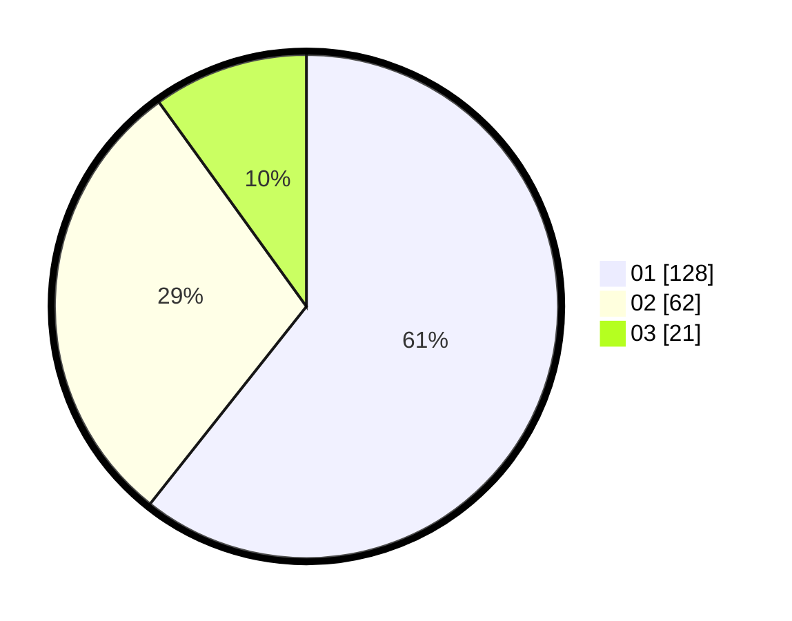

# Hasil

Hasil perolehan suara paslon dapat dilihat pada file paslon-01.txt, paslon-02.txt, dan paslon-03.txt.

Jika tidak ada, artinya data tersebut belum ada pada SIREKAP.

## Perolehan Suara

 * Paslon 01: **128**.
 * Paslon 02: **62**.
 * Paslon 03: **21**.

## Foto C Plano

https://sirekap-obj-formc.kpu.go.id/1a25/pemilu/ppwp/31/74/03/10/04/3174031004059-20240216-120946--12b62bee-3e6c-4361-b471-8892857388f8.jpg

https://sirekap-obj-formc.kpu.go.id/1a25/pemilu/ppwp/31/74/03/10/04/3174031004059-20240216-120949--bfcf0816-5e1a-4049-949b-999f547f969b.jpg

https://sirekap-obj-formc.kpu.go.id/1a25/pemilu/ppwp/31/74/03/10/04/3174031004059-20240216-120947--41bbcff1-f426-4b41-9a27-19c459858333.jpg

## DATA PEMILIH TETAP

Jumlah pemilih dalam DPT: **268**.
 * L: **124**.
 * P: **144**.

## DATA PENGGUNA HAK PILIH

Jumlah pengguna hak pilih dalam DPT: **211**.
 * L: **95**.
 * P: **116**.

Jumlah pengguna hak pilih dalam DPTb: **6**.
 * L: **2**.
 * P: **4**.

Jumlah pengguna hak pilih dalam DPK: **2**.
 * L: **1**.
 * P: **1**.

Jumlah pengguna hak pilih: **219**.
 * L: **98**.
 * P: **121**.

## JUMLAH SUARA SAH DAN TIDAK SAH

JUMLAH SELURUH SUARA SAH: **211**.

JUMLAH SUARA TIDAK SAH: **8**.

JUMLAH SELURUH SUARA SAH DAN SUARA TIDAK SAH: **219**.
