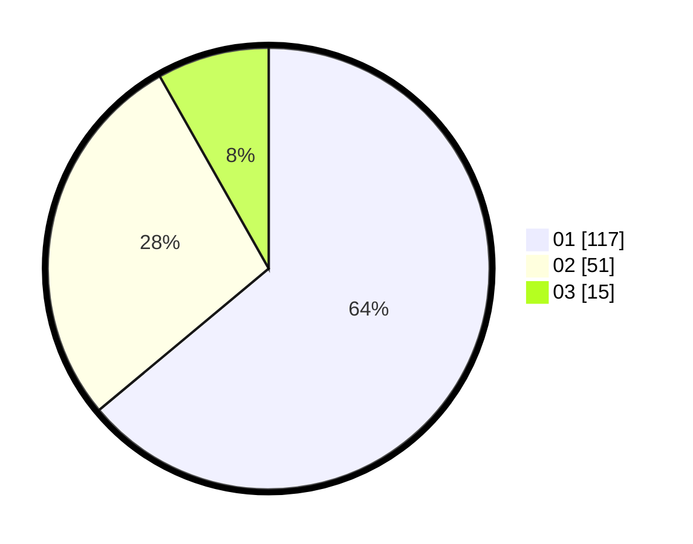

# Hasil

Hasil perolehan suara paslon dapat dilihat pada file paslon-01.txt, paslon-02.txt, dan paslon-03.txt.

Jika tidak ada, artinya data tersebut belum ada pada SIREKAP.

## Perolehan Suara

 * Paslon 01: **117**.
 * Paslon 02: **51**.
 * Paslon 03: **15**.

## Foto C Plano

https://sirekap-obj-formc.kpu.go.id/27af/pemilu/ppwp/31/74/03/10/04/3174031004081-20240216-143233--34b0e3ac-5ba7-4e8f-a38f-f6f20cd5be5d.jpg

https://sirekap-obj-formc.kpu.go.id/27af/pemilu/ppwp/31/74/03/10/04/3174031004081-20240216-143234--04e1e906-ecc6-4cd1-9e5a-f8eacbf576f0.jpg

https://sirekap-obj-formc.kpu.go.id/27af/pemilu/ppwp/31/74/03/10/04/3174031004081-20240216-143234--d8bb9436-add6-4ea8-a46a-5605dc626507.jpg

## DATA PEMILIH TETAP

Jumlah pemilih dalam DPT: **219**.
 * L: **103**.
 * P: **106**.

## DATA PENGGUNA HAK PILIH

Jumlah pengguna hak pilih dalam DPT: **183**.
 * L: **82**.
 * P: **101**.

Jumlah pengguna hak pilih dalam DPTb: **0**.
 * L: **0**.
 * P: **0**.

Jumlah pengguna hak pilih dalam DPK: **0**.
 * L: **0**.
 * P: **0**.

Jumlah pengguna hak pilih: **183**.
 * L: **82**.
 * P: **101**.

## JUMLAH SUARA SAH DAN TIDAK SAH

JUMLAH SELURUH SUARA SAH: **183**.

JUMLAH SUARA TIDAK SAH: **0**.

JUMLAH SELURUH SUARA SAH DAN SUARA TIDAK SAH: **183**.
