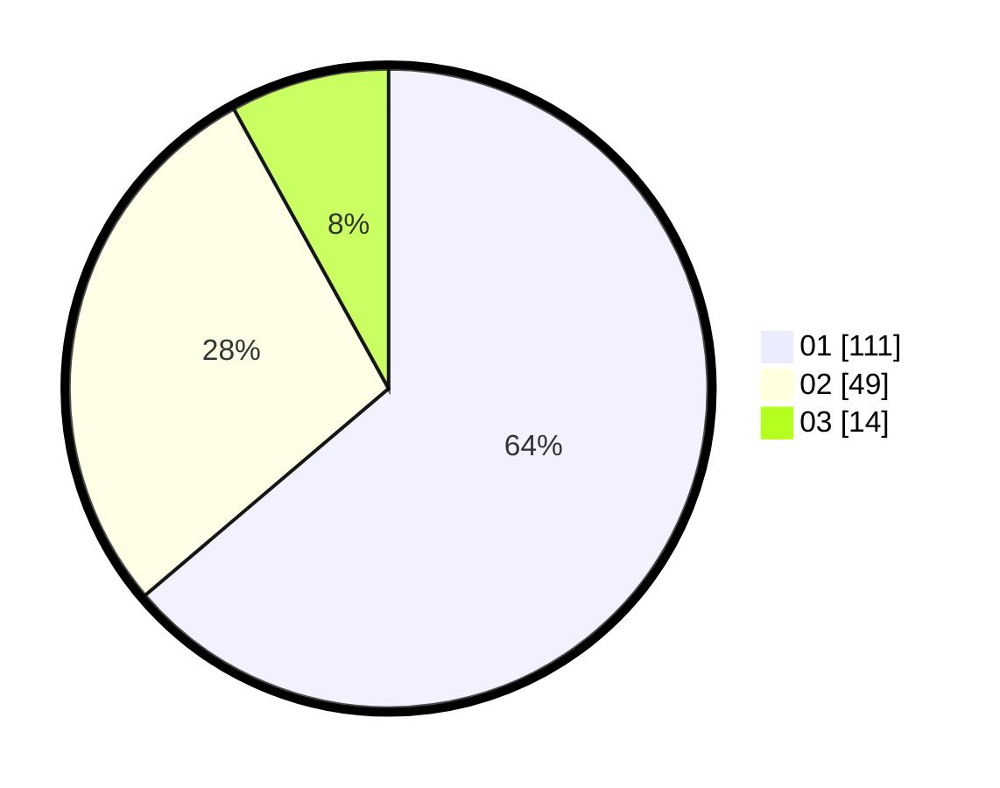

# Hasil

Hasil perolehan suara paslon dapat dilihat pada file paslon-01.txt, paslon-02.txt, dan paslon-03.txt.

Jika tidak ada, artinya data tersebut belum ada pada SIREKAP.

## Perolehan Suara

 * Paslon 01: **111**.
 * Paslon 02: **49**.
 * Paslon 03: **14**.

## Foto C Plano

https://sirekap-obj-formc.kpu.go.id/e38d/pemilu/ppwp/31/74/03/10/04/3174031004088-20240216-061552--d2a34180-1f38-485d-848a-6d6c8beecaee.jpg

https://sirekap-obj-formc.kpu.go.id/e38d/pemilu/ppwp/31/74/03/10/04/3174031004088-20240216-061558--db783514-1e4e-49cd-b5e4-eb2ccee988f7.jpg

https://sirekap-obj-formc.kpu.go.id/e38d/pemilu/ppwp/31/74/03/10/04/3174031004088-20240216-061555--1f63b264-9ef6-46fb-b106-3e9f8616e188.jpg

## DATA PEMILIH TETAP

Jumlah pemilih dalam DPT: **210**.
 * L: **103**.
 * P: **107**.

## DATA PENGGUNA HAK PILIH

Jumlah pengguna hak pilih dalam DPT: **162**.
 * L: **78**.
 * P: **84**.

Jumlah pengguna hak pilih dalam DPTb: **10**.
 * L: **4**.
 * P: **6**.

Jumlah pengguna hak pilih dalam DPK: **2**.
 * L: **1**.
 * P: **1**.

Jumlah pengguna hak pilih: **174**.
 * L: **83**.
 * P: **91**.

## JUMLAH SUARA SAH DAN TIDAK SAH

JUMLAH SELURUH SUARA SAH: **174**.

JUMLAH SUARA TIDAK SAH: **0**.

JUMLAH SELURUH SUARA SAH DAN SUARA TIDAK SAH: **174**.
