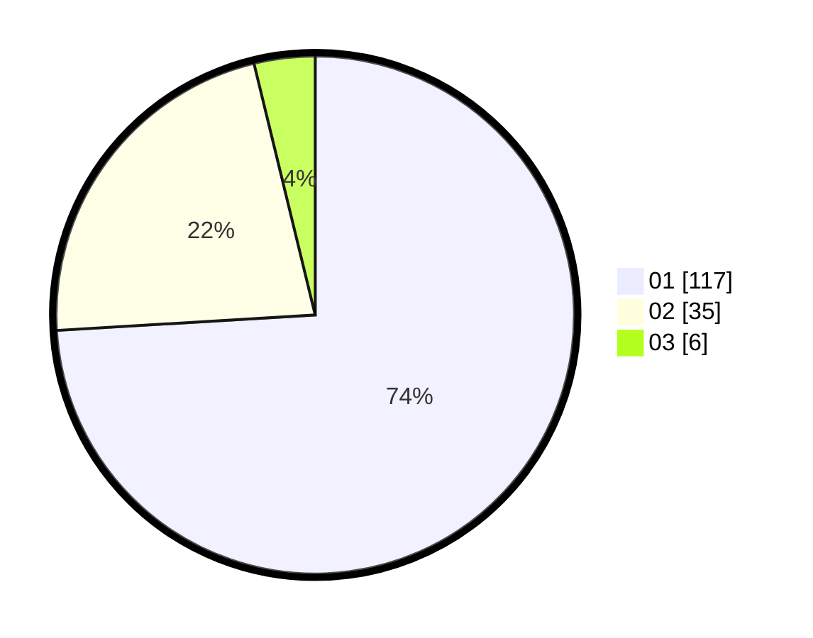

# Hasil

Hasil perolehan suara paslon dapat dilihat pada file paslon-01.txt, paslon-02.txt, dan paslon-03.txt.

Jika tidak ada, artinya data tersebut belum ada pada SIREKAP.

## Perolehan Suara

 * Paslon 01: **117**.
 * Paslon 02: **35**.
 * Paslon 03: **6**.

## Foto C Plano

https://sirekap-obj-formc.kpu.go.id/098f/pemilu/ppwp/31/74/03/10/04/3174031004089-20240216-040535--80a01fbd-84b4-4520-9223-24bb9238b605.jpg

https://sirekap-obj-formc.kpu.go.id/098f/pemilu/ppwp/31/74/03/10/04/3174031004089-20240216-040556--536f243f-3ade-4868-aabc-9326e04de7dc.jpg

https://sirekap-obj-formc.kpu.go.id/098f/pemilu/ppwp/31/74/03/10/04/3174031004089-20240216-040545--14735b58-f23a-4971-b732-1fc8caafc632.jpg

## DATA PEMILIH TETAP

Jumlah pemilih dalam DPT: **214**.
 * L: **114**.
 * P: **100**.

## DATA PENGGUNA HAK PILIH

Jumlah pengguna hak pilih dalam DPT: **156**.
 * L: **74**.
 * P: **82**.

Jumlah pengguna hak pilih dalam DPTb: **4**.
 * L: **4**.
 * P: **0**.

Jumlah pengguna hak pilih dalam DPK: **0**.
 * L: **0**.
 * P: **0**.

Jumlah pengguna hak pilih: **160**.
 * L: **78**.
 * P: **82**.

## JUMLAH SUARA SAH DAN TIDAK SAH

JUMLAH SELURUH SUARA SAH: **158**.

JUMLAH SUARA TIDAK SAH: **2**.

JUMLAH SELURUH SUARA SAH DAN SUARA TIDAK SAH: **160**.
