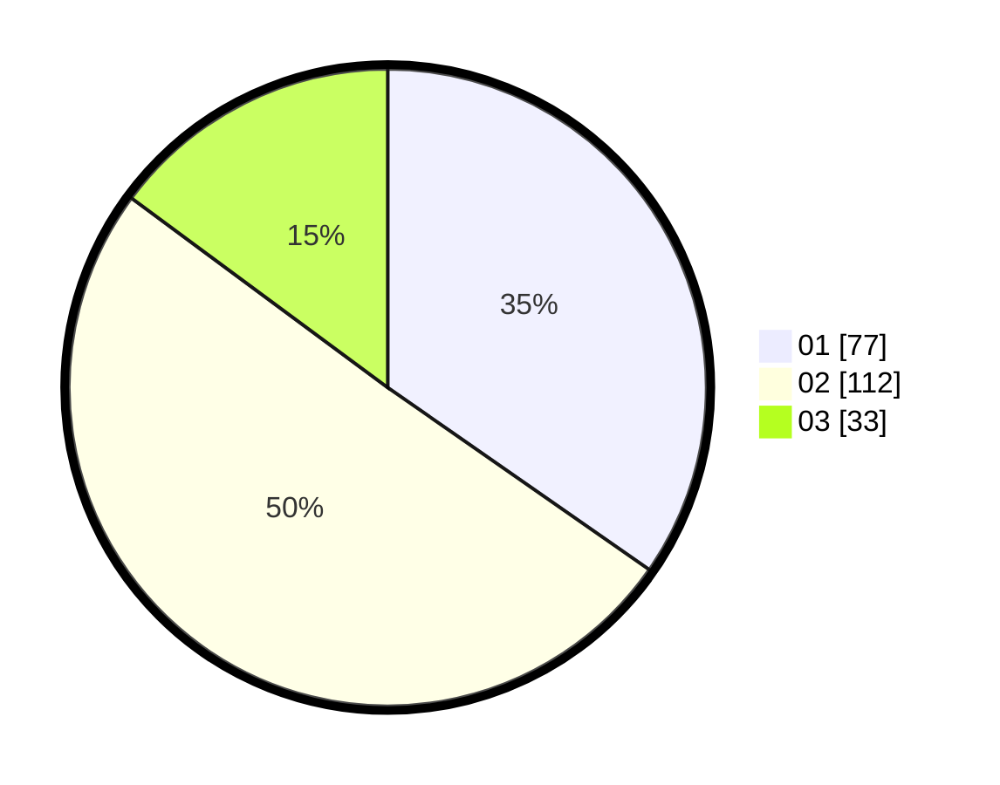

# Hasil

Hasil perolehan suara paslon dapat dilihat pada file paslon-01.txt, paslon-02.txt, dan paslon-03.txt.

Jika tidak ada, artinya data tersebut belum ada pada SIREKAP.

## Perolehan Suara

 * Paslon 01: **77**.
 * Paslon 02: **112**.
 * Paslon 03: **33**.

## Foto C Plano

https://sirekap-obj-formc.kpu.go.id/2469/pemilu/ppwp/31/74/03/10/04/3174031004092-20240216-021657--bfab2f30-dccc-4f15-9414-f9ac3336b237.jpg

https://sirekap-obj-formc.kpu.go.id/2469/pemilu/ppwp/31/74/03/10/04/3174031004092-20240216-021658--17864b58-5d0e-4acd-af61-3bfcfc1d1464.jpg

https://sirekap-obj-formc.kpu.go.id/2469/pemilu/ppwp/31/74/03/10/04/3174031004092-20240216-021658--69df45ec-4721-4be1-a67f-b27a8c26918c.jpg

## DATA PEMILIH TETAP

Jumlah pemilih dalam DPT: **281**.
 * L: **150**.
 * P: **131**.

## DATA PENGGUNA HAK PILIH

Jumlah pengguna hak pilih dalam DPT: **217**.
 * L: **105**.
 * P: **112**.

Jumlah pengguna hak pilih dalam DPTb: **6**.
 * L: **3**.
 * P: **3**.

Jumlah pengguna hak pilih dalam DPK: **0**.
 * L: **0**.
 * P: **0**.

Jumlah pengguna hak pilih: **223**.
 * L: **108**.
 * P: **115**.

## JUMLAH SUARA SAH DAN TIDAK SAH

JUMLAH SELURUH SUARA SAH: **222**.

JUMLAH SUARA TIDAK SAH: **1**.

JUMLAH SELURUH SUARA SAH DAN SUARA TIDAK SAH: **223**.
