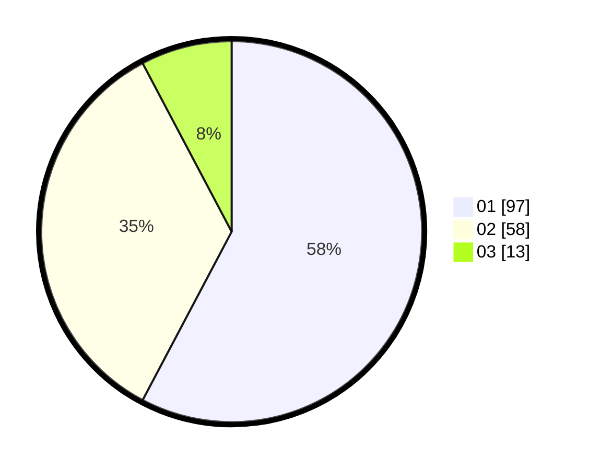

# Hasil

Hasil perolehan suara paslon dapat dilihat pada file paslon-01.txt, paslon-02.txt, dan paslon-03.txt.

Jika tidak ada, artinya data tersebut belum ada pada SIREKAP.

## Perolehan Suara

 * Paslon 01: **97**.
 * Paslon 02: **58**.
 * Paslon 03: **13**.

## Foto C Plano

https://sirekap-obj-formc.kpu.go.id/6f6b/pemilu/ppwp/31/74/03/10/04/3174031004105-20240215-020513--cec7f49e-cd94-4f7f-8e86-ead5fdbdc515.jpg

https://sirekap-obj-formc.kpu.go.id/6f6b/pemilu/ppwp/31/74/03/10/04/3174031004105-20240215-020535--e231aaf6-1294-4c7e-a112-94db2a56e9f2.jpg

https://sirekap-obj-formc.kpu.go.id/6f6b/pemilu/ppwp/31/74/03/10/04/3174031004105-20240215-020524--bd406e40-2d24-4893-8efb-c5c033429cd3.jpg

## DATA PEMILIH TETAP

Jumlah pemilih dalam DPT: **232**.
 * L: **115**.
 * P: **117**.

## DATA PENGGUNA HAK PILIH

Jumlah pengguna hak pilih dalam DPT: **163**.
 * L: **73**.
 * P: **90**.

Jumlah pengguna hak pilih dalam DPTb: **3**.
 * L: **1**.
 * P: **2**.

Jumlah pengguna hak pilih dalam DPK: **5**.
 * L: **3**.
 * P: **2**.

Jumlah pengguna hak pilih: **171**.
 * L: **77**.
 * P: **94**.

## JUMLAH SUARA SAH DAN TIDAK SAH

JUMLAH SELURUH SUARA SAH: **168**.

JUMLAH SUARA TIDAK SAH: **3**.

JUMLAH SELURUH SUARA SAH DAN SUARA TIDAK SAH: **171**.
