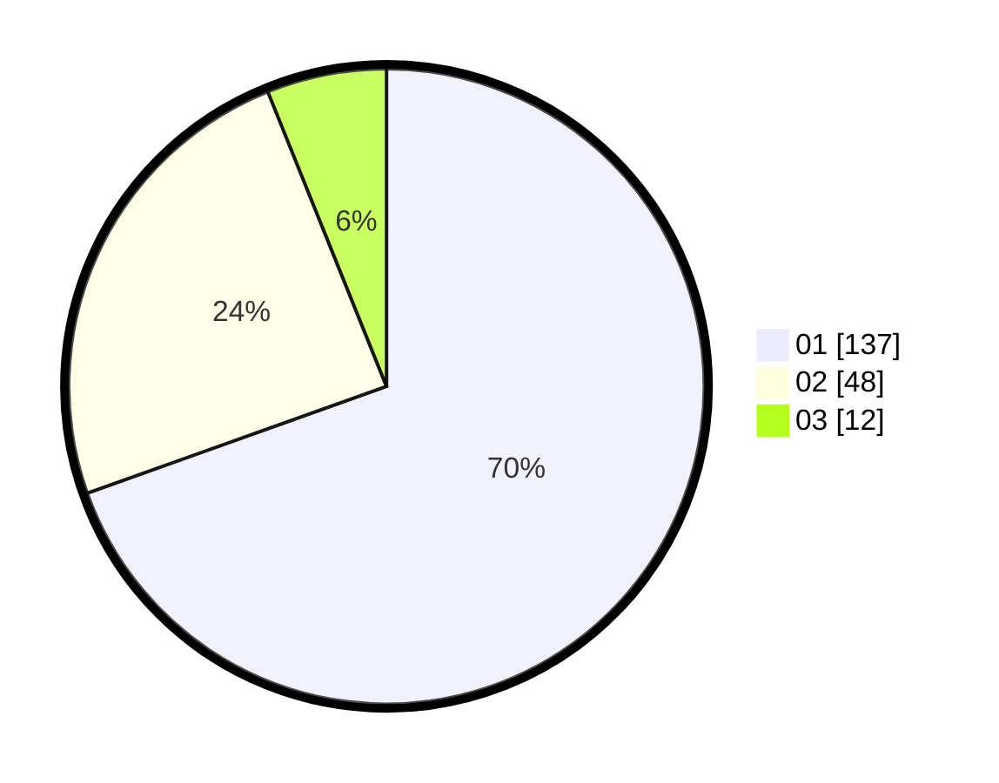

# Hasil

Hasil perolehan suara paslon dapat dilihat pada file paslon-01.txt, paslon-02.txt, dan paslon-03.txt.

Jika tidak ada, artinya data tersebut belum ada pada SIREKAP.

## Perolehan Suara

 * Paslon 01: **137**.
 * Paslon 02: **48**.
 * Paslon 03: **12**.

## Foto C Plano

https://sirekap-obj-formc.kpu.go.id/f126/pemilu/ppwp/31/74/03/10/04/3174031004110-20240216-132028--d9ec7458-9ffb-47db-8604-4db0b42cbe4c.jpg

https://sirekap-obj-formc.kpu.go.id/f126/pemilu/ppwp/31/74/03/10/04/3174031004110-20240216-132029--d52e4102-5f5e-49be-960b-8707d8349bab.jpg

https://sirekap-obj-formc.kpu.go.id/f126/pemilu/ppwp/31/74/03/10/04/3174031004110-20240216-132029--5aeae8fb-260f-47e7-9711-fe9006cd132e.jpg

## DATA PEMILIH TETAP

Jumlah pemilih dalam DPT: **252**.
 * L: **127**.
 * P: **125**.

## DATA PENGGUNA HAK PILIH

Jumlah pengguna hak pilih dalam DPT: **195**.
 * L: **101**.
 * P: **94**.

Jumlah pengguna hak pilih dalam DPTb: **2**.
 * L: **0**.
 * P: **2**.

Jumlah pengguna hak pilih dalam DPK: **1**.
 * L: **1**.
 * P: **0**.

Jumlah pengguna hak pilih: **198**.
 * L: **102**.
 * P: **96**.

## JUMLAH SUARA SAH DAN TIDAK SAH

JUMLAH SELURUH SUARA SAH: **197**.

JUMLAH SUARA TIDAK SAH: **1**.

JUMLAH SELURUH SUARA SAH DAN SUARA TIDAK SAH: **198**.
