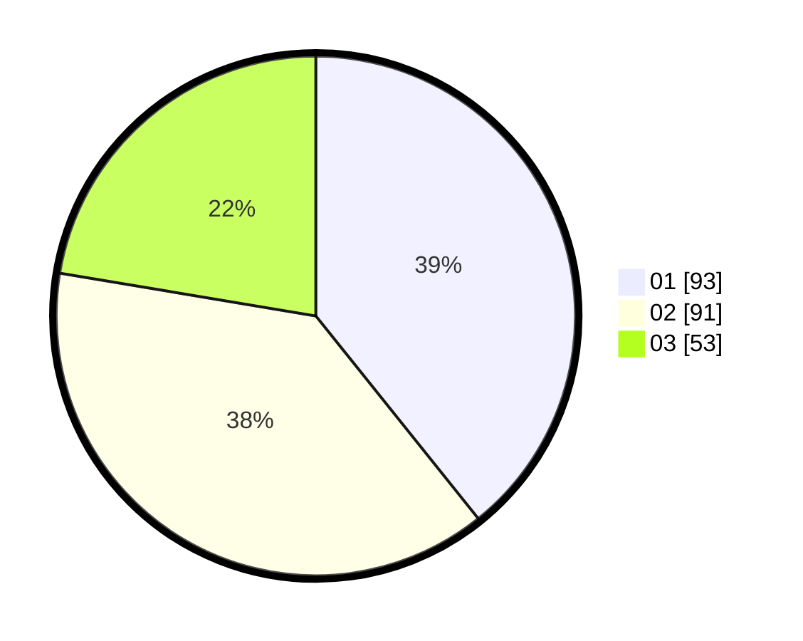

# Hasil

Hasil perolehan suara paslon dapat dilihat pada file paslon-01.txt, paslon-02.txt, dan paslon-03.txt.

Jika tidak ada, artinya data tersebut belum ada pada SIREKAP.

## Perolehan Suara

 * Paslon 01: **93**.
 * Paslon 02: **91**.
 * Paslon 03: **53**.

## Foto C Plano

https://sirekap-obj-formc.kpu.go.id/e99d/pemilu/ppwp/31/74/03/10/05/3174031005001-20240214-184515--482501fe-e3e9-48d8-8270-7425ff6061b8.jpg

https://sirekap-obj-formc.kpu.go.id/e99d/pemilu/ppwp/31/74/03/10/05/3174031005001-20240214-184755--c6523b9f-6479-4e56-8beb-24809df6238d.jpg

https://sirekap-obj-formc.kpu.go.id/e99d/pemilu/ppwp/31/74/03/10/05/3174031005001-20240214-183942--2e60bf40-e5a0-43ea-bac5-28b0173d4fd6.jpg

## DATA PEMILIH TETAP

Jumlah pemilih dalam DPT: **284**.
 * L: **137**.
 * P: **147**.

## DATA PENGGUNA HAK PILIH

Jumlah pengguna hak pilih dalam DPT: **233**.
 * L: **105**.
 * P: **128**.

Jumlah pengguna hak pilih dalam DPTb: **6**.
 * L: **2**.
 * P: **4**.

Jumlah pengguna hak pilih dalam DPK: **1**.
 * L: **1**.
 * P: **0**.

Jumlah pengguna hak pilih: **240**.
 * L: **108**.
 * P: **132**.

## JUMLAH SUARA SAH DAN TIDAK SAH

JUMLAH SELURUH SUARA SAH: **237**.

JUMLAH SUARA TIDAK SAH: **3**.

JUMLAH SELURUH SUARA SAH DAN SUARA TIDAK SAH: **240**.
