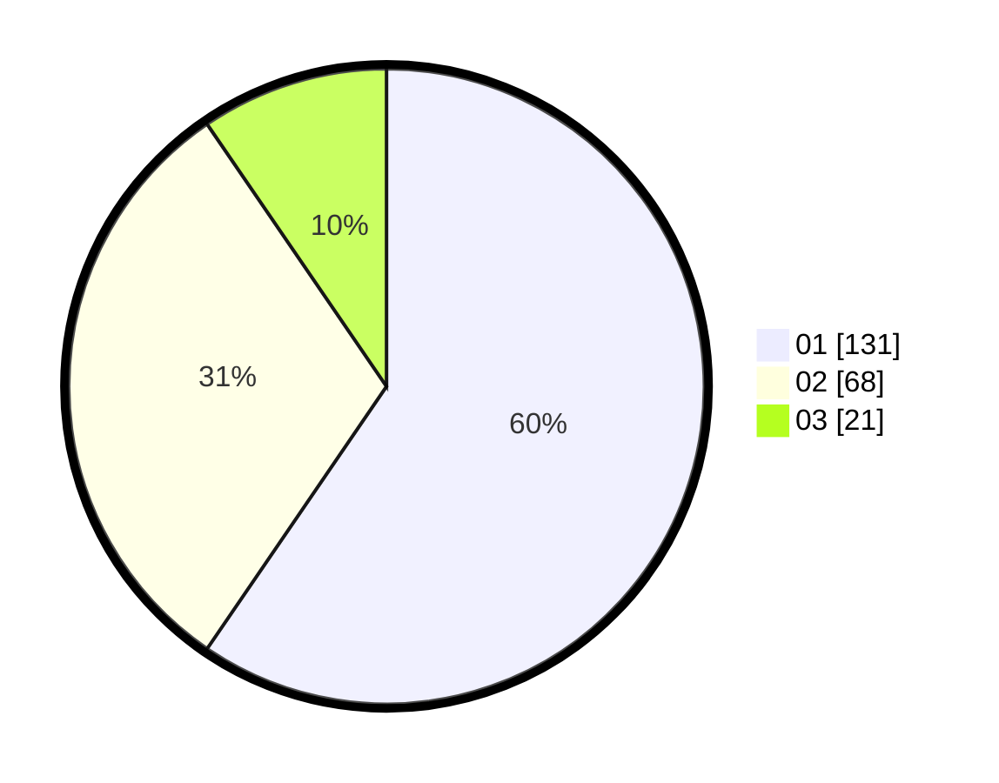

# Hasil

Hasil perolehan suara paslon dapat dilihat pada file paslon-01.txt, paslon-02.txt, dan paslon-03.txt.

Jika tidak ada, artinya data tersebut belum ada pada SIREKAP.

## Perolehan Suara

 * Paslon 01: **131**.
 * Paslon 02: **68**.
 * Paslon 03: **21**.

## Foto C Plano

https://sirekap-obj-formc.kpu.go.id/6e68/pemilu/ppwp/31/74/03/10/05/3174031005029-20240216-155116--b42ac960-2a0d-4ba7-93c2-ad5171738d27.jpg

https://sirekap-obj-formc.kpu.go.id/6e68/pemilu/ppwp/31/74/03/10/05/3174031005029-20240216-155117--b8307e87-8c51-4745-9119-37f849af28af.jpg

https://sirekap-obj-formc.kpu.go.id/6e68/pemilu/ppwp/31/74/03/10/05/3174031005029-20240216-155116--7bdf6a40-4124-420a-80f2-e8969893e6ac.jpg

## DATA PEMILIH TETAP

Jumlah pemilih dalam DPT: **277**.
 * L: **137**.
 * P: **140**.

## DATA PENGGUNA HAK PILIH

Jumlah pengguna hak pilih dalam DPT: **223**.
 * L: **106**.
 * P: **117**.

Jumlah pengguna hak pilih dalam DPTb: **2**.
 * L: **1**.
 * P: **1**.

Jumlah pengguna hak pilih dalam DPK: **0**.
 * L: **0**.
 * P: **0**.

Jumlah pengguna hak pilih: **225**.
 * L: **107**.
 * P: **118**.

## JUMLAH SUARA SAH DAN TIDAK SAH

JUMLAH SELURUH SUARA SAH: **220**.

JUMLAH SUARA TIDAK SAH: **5**.

JUMLAH SELURUH SUARA SAH DAN SUARA TIDAK SAH: **225**.
