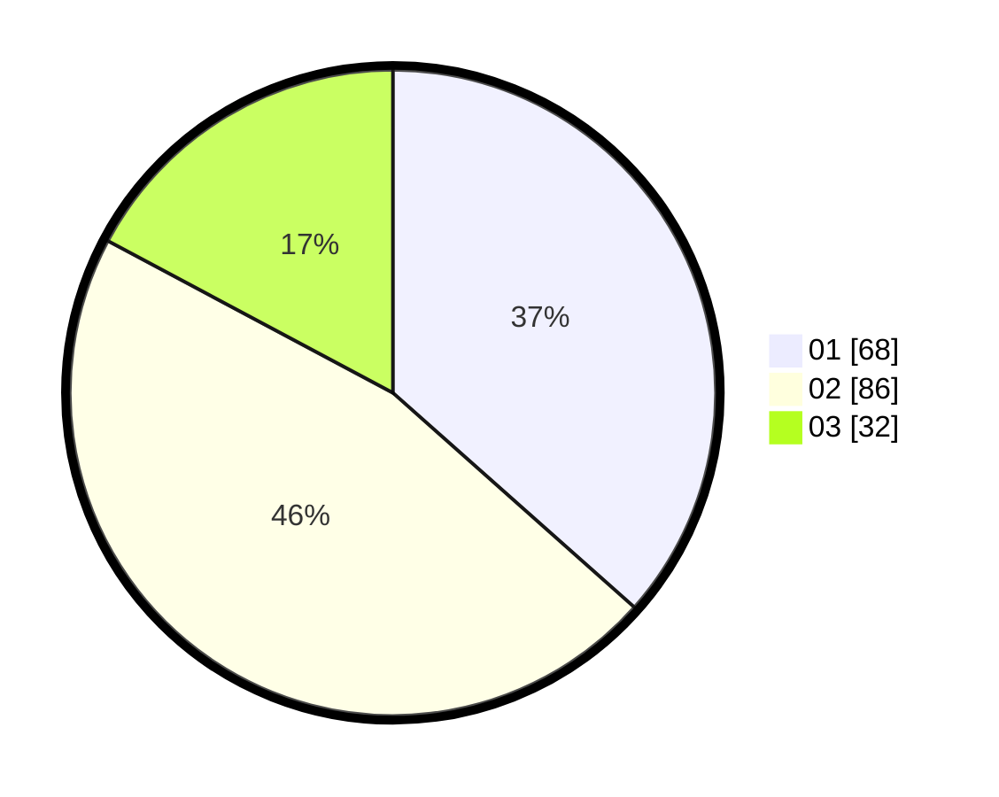

# Hasil

Hasil perolehan suara paslon dapat dilihat pada file paslon-01.txt, paslon-02.txt, dan paslon-03.txt.

Jika tidak ada, artinya data tersebut belum ada pada SIREKAP.

## Perolehan Suara

 * Paslon 01: **68**.
 * Paslon 02: **86**.
 * Paslon 03: **32**.

## Foto C Plano

https://sirekap-obj-formc.kpu.go.id/c11e/pemilu/ppwp/31/74/03/10/05/3174031005033-20240214-191857--5d7c4b6c-dd6d-4a2a-b6a5-d30075c78fc6.jpg

https://sirekap-obj-formc.kpu.go.id/c11e/pemilu/ppwp/31/74/03/10/05/3174031005033-20240214-192006--4562dc74-ae52-4819-949f-bb24357c60f8.jpg

https://sirekap-obj-formc.kpu.go.id/c11e/pemilu/ppwp/31/74/03/10/05/3174031005033-20240214-192131--e96c68d7-902f-4c4d-93ff-373a7d916de8.jpg
