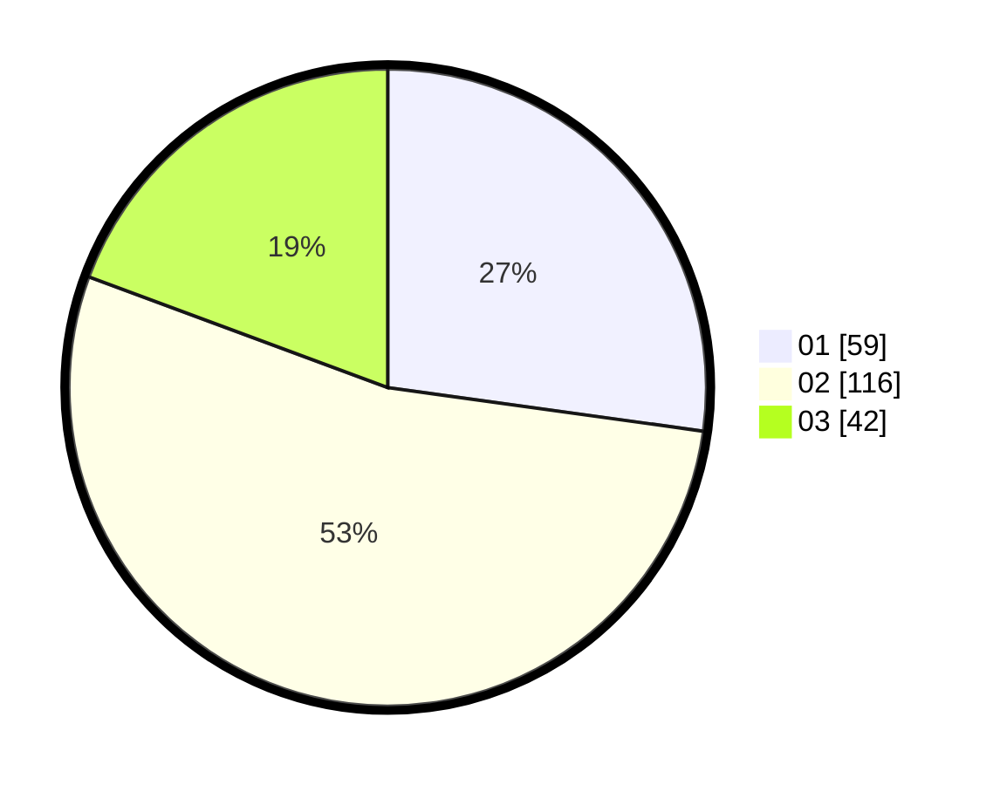

# Hasil

Hasil perolehan suara paslon dapat dilihat pada file paslon-01.txt, paslon-02.txt, dan paslon-03.txt.

Jika tidak ada, artinya data tersebut belum ada pada SIREKAP.

## Perolehan Suara

 * Paslon 01: **59**.
 * Paslon 02: **116**.
 * Paslon 03: **42**.

## Foto C Plano

https://sirekap-obj-formc.kpu.go.id/1d91/pemilu/ppwp/31/74/03/10/05/3174031005035-20240214-212146--5f60a554-3f7f-416e-93d8-4b9e11de7d57.jpg

https://sirekap-obj-formc.kpu.go.id/1d91/pemilu/ppwp/31/74/03/10/05/3174031005035-20240214-212217--63f2f09b-25bd-432d-abf4-18fee8df4d42.jpg

https://sirekap-obj-formc.kpu.go.id/1d91/pemilu/ppwp/31/74/03/10/05/3174031005035-20240214-212258--f1096cbc-f91e-4d09-b851-da5010b60d7b.jpg

## DATA PEMILIH TETAP

Jumlah pemilih dalam DPT: **265**.
 * L: **134**.
 * P: **131**.

## DATA PENGGUNA HAK PILIH

Jumlah pengguna hak pilih dalam DPT: **211**.
 * L: **105**.
 * P: **106**.

Jumlah pengguna hak pilih dalam DPTb: **7**.
 * L: **5**.
 * P: **2**.

Jumlah pengguna hak pilih dalam DPK: **3**.
 * L: **2**.
 * P: **1**.

Jumlah pengguna hak pilih: **221**.
 * L: **112**.
 * P: **109**.

## JUMLAH SUARA SAH DAN TIDAK SAH

JUMLAH SELURUH SUARA SAH: **217**.

JUMLAH SUARA TIDAK SAH: **4**.

JUMLAH SELURUH SUARA SAH DAN SUARA TIDAK SAH: **221**.
