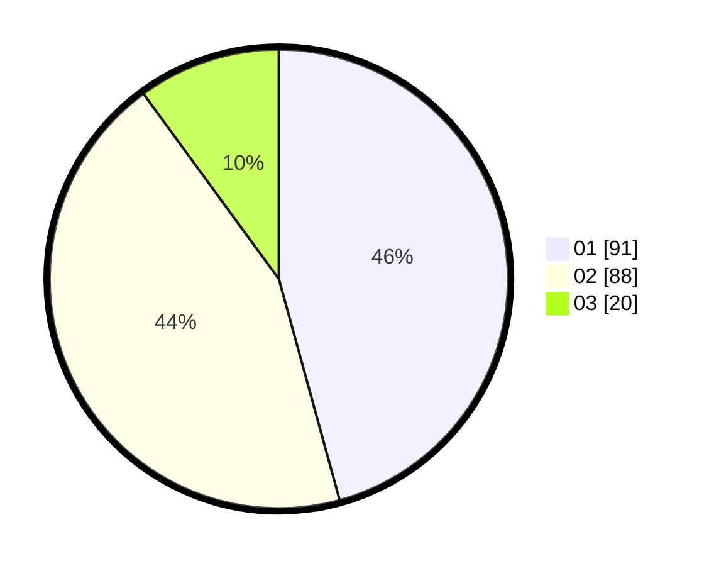

# Hasil

Hasil perolehan suara paslon dapat dilihat pada file paslon-01.txt, paslon-02.txt, dan paslon-03.txt.

Jika tidak ada, artinya data tersebut belum ada pada SIREKAP.

## Perolehan Suara

 * Paslon 01: **91**.
 * Paslon 02: **88**.
 * Paslon 03: **20**.

## Foto C Plano

https://sirekap-obj-formc.kpu.go.id/fe95/pemilu/ppwp/31/74/04/10/01/3174041001009-20240214-155032--f5b6804c-8119-42d0-ac05-ea1741bc7463.jpg

https://sirekap-obj-formc.kpu.go.id/fe95/pemilu/ppwp/31/74/04/10/01/3174041001009-20240214-155050--358864b9-0783-4362-b599-766c28e07a60.jpg

https://sirekap-obj-formc.kpu.go.id/fe95/pemilu/ppwp/31/74/04/10/01/3174041001009-20240214-155120--d4812e79-0b75-4239-b3ab-4a093f876cae.jpg

## DATA PEMILIH TETAP

Jumlah pemilih dalam DPT: **266**.
 * L: **138**.
 * P: **128**.

## DATA PENGGUNA HAK PILIH

Jumlah pengguna hak pilih dalam DPT: **202**.
 * L: **100**.
 * P: **102**.

Jumlah pengguna hak pilih dalam DPTb: **1**.
 * L: **1**.
 * P: **0**.

Jumlah pengguna hak pilih dalam DPK: **0**.
 * L: **0**.
 * P: **0**.

Jumlah pengguna hak pilih: **203**.
 * L: **101**.
 * P: **102**.

## JUMLAH SUARA SAH DAN TIDAK SAH

JUMLAH SELURUH SUARA SAH: **199**.

JUMLAH SUARA TIDAK SAH: **4**.

JUMLAH SELURUH SUARA SAH DAN SUARA TIDAK SAH: **203**.
