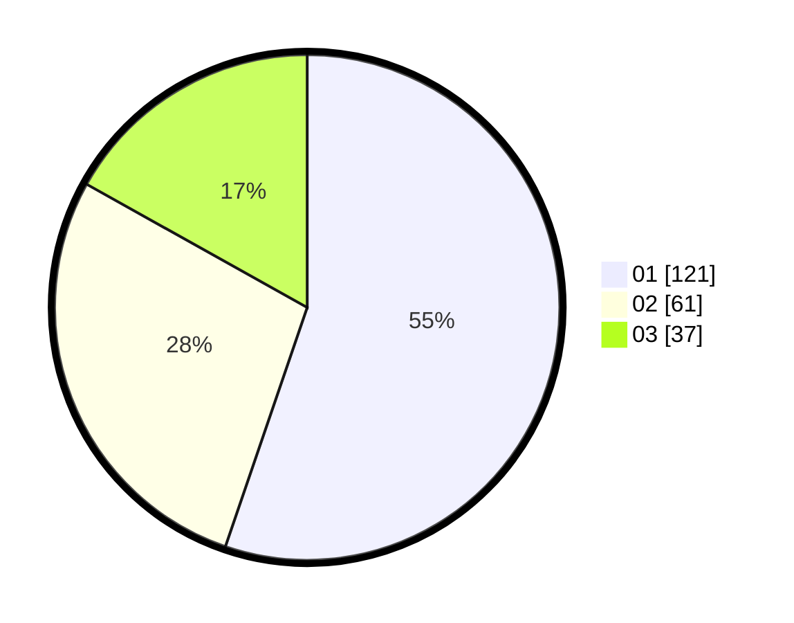

# Hasil

Hasil perolehan suara paslon dapat dilihat pada file paslon-01.txt, paslon-02.txt, dan paslon-03.txt.

Jika tidak ada, artinya data tersebut belum ada pada SIREKAP.

## Perolehan Suara

 * Paslon 01: **121**.
 * Paslon 02: **61**.
 * Paslon 03: **37**.

## Foto C Plano

https://sirekap-obj-formc.kpu.go.id/2372/pemilu/ppwp/31/74/04/10/01/3174041001019-20240214-191736--ccd5ebeb-e75f-4677-bf44-cc9422a55c95.jpg

https://sirekap-obj-formc.kpu.go.id/2372/pemilu/ppwp/31/74/04/10/01/3174041001019-20240214-191820--3eaa824a-6251-4814-b797-681715dc13b4.jpg

https://sirekap-obj-formc.kpu.go.id/2372/pemilu/ppwp/31/74/04/10/01/3174041001019-20240214-191927--419e61b8-f4d0-4368-9d0c-c7eb48e9632e.jpg

## DATA PEMILIH TETAP

Jumlah pemilih dalam DPT: **288**.
 * L: **142**.
 * P: **146**.

## DATA PENGGUNA HAK PILIH

Jumlah pengguna hak pilih dalam DPT: **215**.
 * L: **106**.
 * P: **109**.

Jumlah pengguna hak pilih dalam DPTb: **8**.
 * L: **0**.
 * P: **8**.

Jumlah pengguna hak pilih dalam DPK: **1**.
 * L: **0**.
 * P: **1**.

Jumlah pengguna hak pilih: **224**.
 * L: **106**.
 * P: **118**.

## JUMLAH SUARA SAH DAN TIDAK SAH

JUMLAH SELURUH SUARA SAH: **219**.

JUMLAH SUARA TIDAK SAH: **5**.

JUMLAH SELURUH SUARA SAH DAN SUARA TIDAK SAH: **224**.
