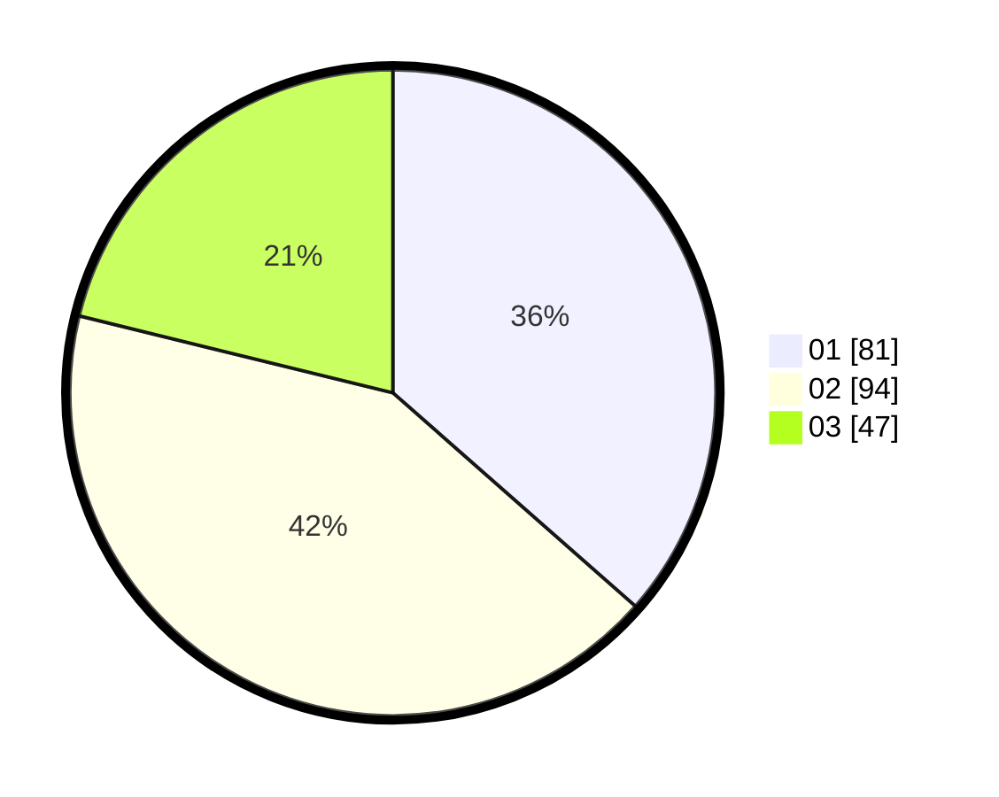

# Hasil

Hasil perolehan suara paslon dapat dilihat pada file paslon-01.txt, paslon-02.txt, dan paslon-03.txt.

Jika tidak ada, artinya data tersebut belum ada pada SIREKAP.

## Perolehan Suara

 * Paslon 01: **81**.
 * Paslon 02: **94**.
 * Paslon 03: **47**.

## Foto C Plano

https://sirekap-obj-formc.kpu.go.id/7040/pemilu/ppwp/31/74/04/10/01/3174041001022-20240216-150506--f1e2d67d-07fa-4e93-a2f7-92d9d42a366b.jpg

https://sirekap-obj-formc.kpu.go.id/7040/pemilu/ppwp/31/74/04/10/01/3174041001022-20240216-150508--4897cbd9-5a7f-4940-9bef-b6c0709ee2ab.jpg

https://sirekap-obj-formc.kpu.go.id/7040/pemilu/ppwp/31/74/04/10/01/3174041001022-20240216-150507--2e18c0dc-a597-4756-8f67-d588d20ae75c.jpg

## DATA PEMILIH TETAP

Jumlah pemilih dalam DPT: **293**.
 * L: **151**.
 * P: **142**.

## DATA PENGGUNA HAK PILIH

Jumlah pengguna hak pilih dalam DPT: **216**.
 * L: **110**.
 * P: **106**.

Jumlah pengguna hak pilih dalam DPTb: **1**.
 * L: **1**.
 * P: **0**.

Jumlah pengguna hak pilih dalam DPK: **6**.
 * L: **3**.
 * P: **3**.

Jumlah pengguna hak pilih: **223**.
 * L: **114**.
 * P: **109**.

## JUMLAH SUARA SAH DAN TIDAK SAH

JUMLAH SELURUH SUARA SAH: **222**.

JUMLAH SUARA TIDAK SAH: **1**.

JUMLAH SELURUH SUARA SAH DAN SUARA TIDAK SAH: **223**.
