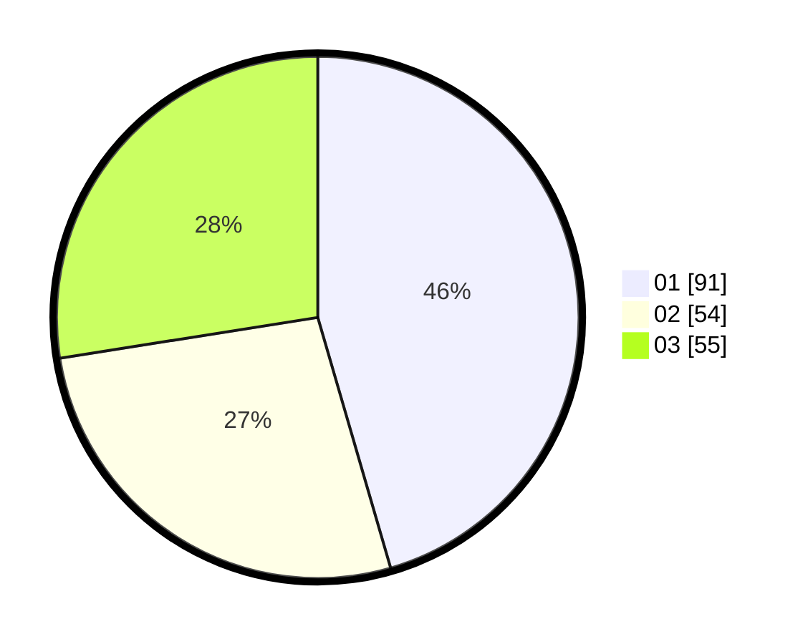

# Hasil

Hasil perolehan suara paslon dapat dilihat pada file paslon-01.txt, paslon-02.txt, dan paslon-03.txt.

Jika tidak ada, artinya data tersebut belum ada pada SIREKAP.

## Perolehan Suara

 * Paslon 01: **91**.
 * Paslon 02: **54**.
 * Paslon 03: **55**.

## Foto C Plano

https://sirekap-obj-formc.kpu.go.id/b8a8/pemilu/ppwp/31/74/04/10/01/3174041001026-20240214-193333--e74e13ba-2bb1-4513-bdc8-436ef2f428f3.jpg

https://sirekap-obj-formc.kpu.go.id/b8a8/pemilu/ppwp/31/74/04/10/01/3174041001026-20240214-193408--cca0c28f-bc14-43e6-a818-92b357deca15.jpg

https://sirekap-obj-formc.kpu.go.id/b8a8/pemilu/ppwp/31/74/04/10/01/3174041001026-20240214-193451--408979e4-cb88-4b04-9a7c-8d8d837dc5e2.jpg

## DATA PEMILIH TETAP

Jumlah pemilih dalam DPT: **238**.
 * L: **110**.
 * P: **128**.

## DATA PENGGUNA HAK PILIH

Jumlah pengguna hak pilih dalam DPT: **194**.
 * L: **85**.
 * P: **109**.

Jumlah pengguna hak pilih dalam DPTb: **11**.
 * L: **2**.
 * P: **9**.

Jumlah pengguna hak pilih dalam DPK: **1**.
 * L: **0**.
 * P: **1**.

Jumlah pengguna hak pilih: **206**.
 * L: **87**.
 * P: **119**.

## JUMLAH SUARA SAH DAN TIDAK SAH

JUMLAH SELURUH SUARA SAH: **200**.

JUMLAH SUARA TIDAK SAH: **6**.

JUMLAH SELURUH SUARA SAH DAN SUARA TIDAK SAH: **206**.
