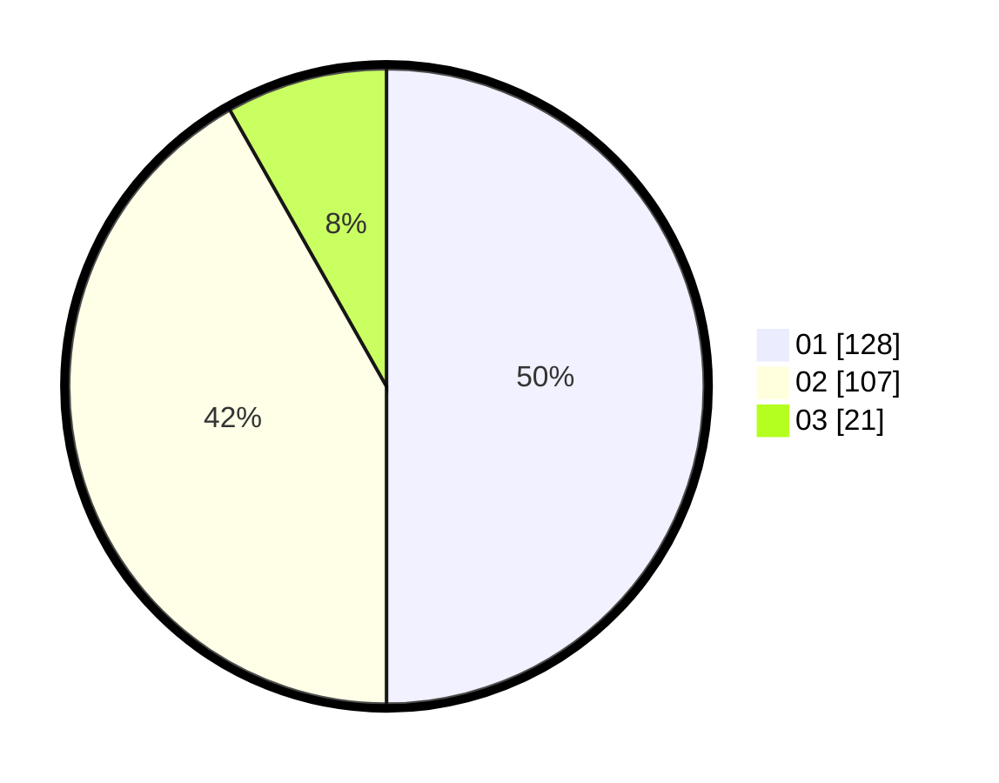

# Hasil

Hasil perolehan suara paslon dapat dilihat pada file paslon-01.txt, paslon-02.txt, dan paslon-03.txt.

Jika tidak ada, artinya data tersebut belum ada pada SIREKAP.

## Perolehan Suara

 * Paslon 01: **128**.
 * Paslon 02: **107**.
 * Paslon 03: **21**.

## Foto C Plano

https://sirekap-obj-formc.kpu.go.id/7180/pemilu/ppwp/31/74/04/10/01/3174041001027-20240214-184639--37c4abe5-1237-48ef-97e5-72f073c77283.jpg

https://sirekap-obj-formc.kpu.go.id/7180/pemilu/ppwp/31/74/04/10/01/3174041001027-20240214-184707--1446b76f-5d95-40fe-8e19-269d8fa5de53.jpg

https://sirekap-obj-formc.kpu.go.id/7180/pemilu/ppwp/31/74/04/10/01/3174041001027-20240214-184725--104f7897-cdb7-4881-8e3d-808243e6214a.jpg

## DATA PEMILIH TETAP

Jumlah pemilih dalam DPT: **278**.
 * L: **137**.
 * P: **141**.

## DATA PENGGUNA HAK PILIH

Jumlah pengguna hak pilih dalam DPT: **238**.
 * L: **111**.
 * P: **127**.

Jumlah pengguna hak pilih dalam DPTb: **22**.
 * L: **4**.
 * P: **18**.

Jumlah pengguna hak pilih dalam DPK: **0**.
 * L: **0**.
 * P: **0**.

Jumlah pengguna hak pilih: **260**.
 * L: **115**.
 * P: **145**.

## JUMLAH SUARA SAH DAN TIDAK SAH

JUMLAH SELURUH SUARA SAH: **256**.

JUMLAH SUARA TIDAK SAH: **4**.

JUMLAH SELURUH SUARA SAH DAN SUARA TIDAK SAH: **260**.
