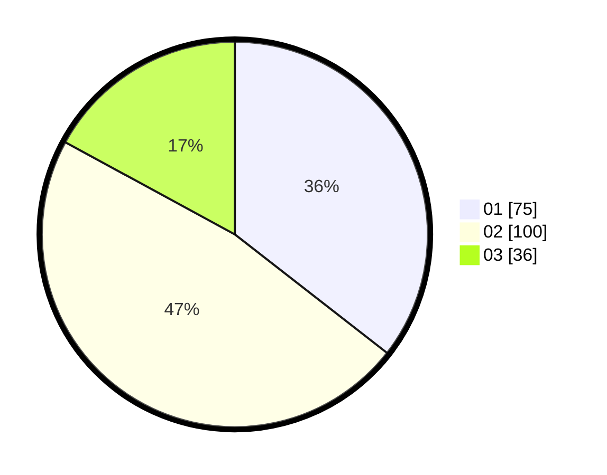

# Hasil

Hasil perolehan suara paslon dapat dilihat pada file paslon-01.txt, paslon-02.txt, dan paslon-03.txt.

Jika tidak ada, artinya data tersebut belum ada pada SIREKAP.

## Perolehan Suara

 * Paslon 01: **75**.
 * Paslon 02: **100**.
 * Paslon 03: **36**.

## Foto C Plano

https://sirekap-obj-formc.kpu.go.id/ccca/pemilu/ppwp/31/74/04/10/01/3174041001033-20240214-155035--324a487d-a7db-446c-a080-5edd539e6e85.jpg

https://sirekap-obj-formc.kpu.go.id/ccca/pemilu/ppwp/31/74/04/10/01/3174041001033-20240214-155132--33d64150-3c04-4049-8c88-332761a245f0.jpg

https://sirekap-obj-formc.kpu.go.id/ccca/pemilu/ppwp/31/74/04/10/01/3174041001033-20240214-155200--d4fe4f44-66f7-4486-8add-8c44f212ad80.jpg

## DATA PEMILIH TETAP

Jumlah pemilih dalam DPT: **286**.
 * L: **146**.
 * P: **140**.

## DATA PENGGUNA HAK PILIH

Jumlah pengguna hak pilih dalam DPT: **206**.
 * L: **98**.
 * P: **108**.

Jumlah pengguna hak pilih dalam DPTb: **7**.
 * L: **4**.
 * P: **3**.

Jumlah pengguna hak pilih dalam DPK: **0**.
 * L: **0**.
 * P: **0**.

Jumlah pengguna hak pilih: **213**.
 * L: **102**.
 * P: **111**.

## JUMLAH SUARA SAH DAN TIDAK SAH

JUMLAH SELURUH SUARA SAH: **211**.

JUMLAH SUARA TIDAK SAH: **2**.

JUMLAH SELURUH SUARA SAH DAN SUARA TIDAK SAH: **213**.
