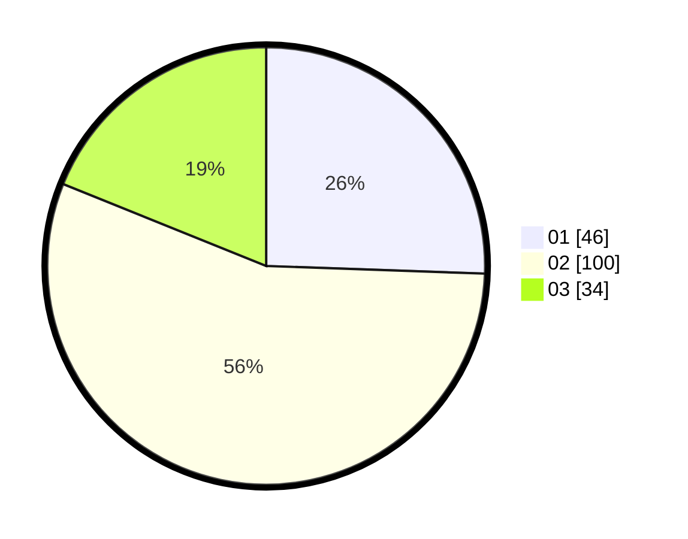

# Hasil

Hasil perolehan suara paslon dapat dilihat pada file paslon-01.txt, paslon-02.txt, dan paslon-03.txt.

Jika tidak ada, artinya data tersebut belum ada pada SIREKAP.

## Perolehan Suara

 * Paslon 01: **46**.
 * Paslon 02: **100**.
 * Paslon 03: **34**.

## Foto C Plano

https://sirekap-obj-formc.kpu.go.id/b748/pemilu/ppwp/31/74/04/10/01/3174041001036-20240214-200758--651a6d3f-6f46-451b-805f-dabcdff5d4d3.jpg

https://sirekap-obj-formc.kpu.go.id/b748/pemilu/ppwp/31/74/04/10/01/3174041001036-20240215-005757--6df24ef5-5249-46d0-b0d6-5c2578086bce.jpg
