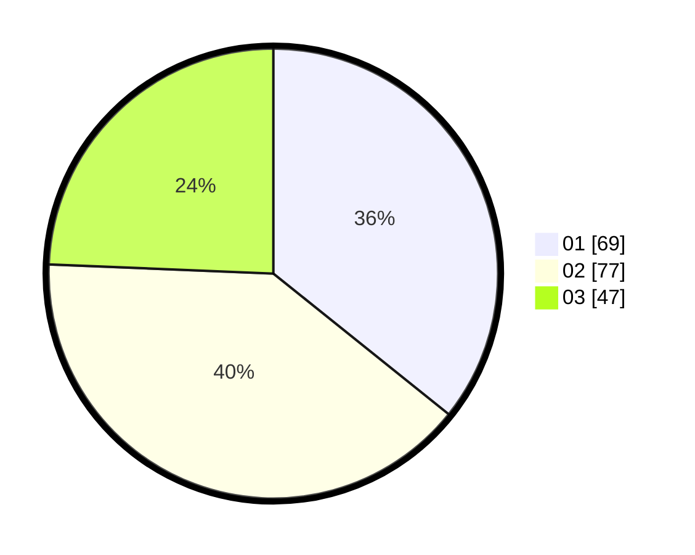

# Hasil

Hasil perolehan suara paslon dapat dilihat pada file paslon-01.txt, paslon-02.txt, dan paslon-03.txt.

Jika tidak ada, artinya data tersebut belum ada pada SIREKAP.

## Perolehan Suara

 * Paslon 01: **69**.
 * Paslon 02: **77**.
 * Paslon 03: **47**.

## Foto C Plano

https://sirekap-obj-formc.kpu.go.id/98c7/pemilu/ppwp/31/74/04/10/01/3174041001038-20240214-192613--af24b8d0-22da-4354-97d1-15fdeedf124d.jpg

https://sirekap-obj-formc.kpu.go.id/98c7/pemilu/ppwp/31/74/04/10/01/3174041001038-20240214-191917--c7fa138e-6566-430c-8ef3-3ab60096f849.jpg

https://sirekap-obj-formc.kpu.go.id/98c7/pemilu/ppwp/31/74/04/10/01/3174041001038-20240214-192236--317e2d65-16d1-4bd8-b154-69348fcf7226.jpg

## DATA PEMILIH TETAP

Jumlah pemilih dalam DPT: **234**.
 * L: **94**.
 * P: **140**.

## DATA PENGGUNA HAK PILIH

Jumlah pengguna hak pilih dalam DPT: **186**.
 * L: **74**.
 * P: **112**.

Jumlah pengguna hak pilih dalam DPTb: **6**.
 * L: **5**.
 * P: **1**.

Jumlah pengguna hak pilih dalam DPK: **2**.
 * L: **1**.
 * P: **1**.

Jumlah pengguna hak pilih: **194**.
 * L: **80**.
 * P: **114**.

## JUMLAH SUARA SAH DAN TIDAK SAH

JUMLAH SELURUH SUARA SAH: **193**.

JUMLAH SUARA TIDAK SAH: **1**.

JUMLAH SELURUH SUARA SAH DAN SUARA TIDAK SAH: **194**.
