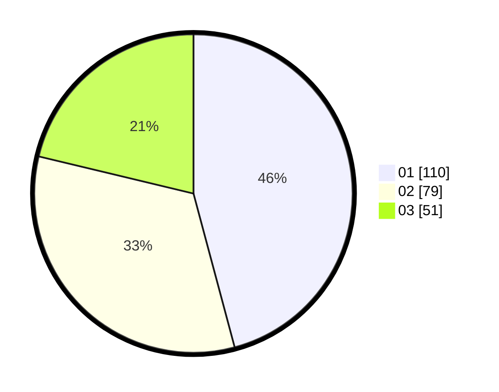

# Hasil

Hasil perolehan suara paslon dapat dilihat pada file paslon-01.txt, paslon-02.txt, dan paslon-03.txt.

Jika tidak ada, artinya data tersebut belum ada pada SIREKAP.

## Perolehan Suara

 * Paslon 01: **110**.
 * Paslon 02: **79**.
 * Paslon 03: **51**.

## Foto C Plano

https://sirekap-obj-formc.kpu.go.id/5f47/pemilu/ppwp/31/74/04/10/01/3174041001055-20240216-035007--62ca83f2-1cd6-44ce-bd3f-b56405a66595.jpg

https://sirekap-obj-formc.kpu.go.id/5f47/pemilu/ppwp/31/74/04/10/01/3174041001055-20240216-035012--4f3cb348-3a49-415e-90f4-6b6cd316340c.jpg

https://sirekap-obj-formc.kpu.go.id/5f47/pemilu/ppwp/31/74/04/10/01/3174041001055-20240216-035010--6518705b-9539-4465-b48b-a65b0bf705c9.jpg

## DATA PEMILIH TETAP

Jumlah pemilih dalam DPT: **297**.
 * L: **130**.
 * P: **167**.

## DATA PENGGUNA HAK PILIH

Jumlah pengguna hak pilih dalam DPT: **224**.
 * L: **97**.
 * P: **127**.

Jumlah pengguna hak pilih dalam DPTb: **21**.
 * L: **6**.
 * P: **15**.

Jumlah pengguna hak pilih dalam DPK: **0**.
 * L: **0**.
 * P: **0**.

Jumlah pengguna hak pilih: **245**.
 * L: **103**.
 * P: **142**.

## JUMLAH SUARA SAH DAN TIDAK SAH

JUMLAH SELURUH SUARA SAH: **240**.

JUMLAH SUARA TIDAK SAH: **5**.

JUMLAH SELURUH SUARA SAH DAN SUARA TIDAK SAH: **245**.
