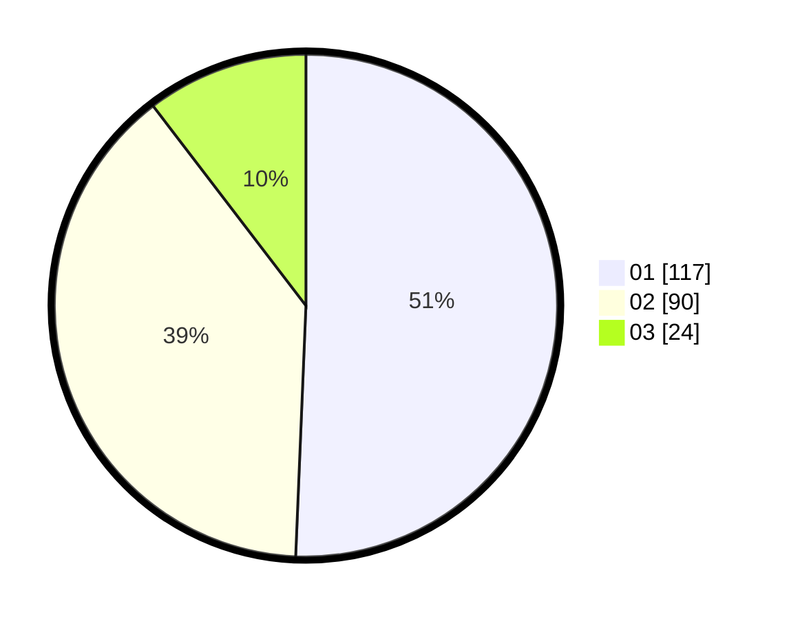

# Hasil

Hasil perolehan suara paslon dapat dilihat pada file paslon-01.txt, paslon-02.txt, dan paslon-03.txt.

Jika tidak ada, artinya data tersebut belum ada pada SIREKAP.

## Perolehan Suara

 * Paslon 01: **117**.
 * Paslon 02: **90**.
 * Paslon 03: **24**.

## Foto C Plano

https://sirekap-obj-formc.kpu.go.id/5e6a/pemilu/ppwp/31/74/04/10/01/3174041001057-20240214-211404--1298889b-1816-496d-a43d-19e3e1716196.jpg

https://sirekap-obj-formc.kpu.go.id/5e6a/pemilu/ppwp/31/74/04/10/01/3174041001057-20240214-211534--5278284a-ad17-4d32-b71f-8687bb9f0913.jpg

https://sirekap-obj-formc.kpu.go.id/5e6a/pemilu/ppwp/31/74/04/10/01/3174041001057-20240214-211628--854babf1-617f-4126-9519-b6a14f5a7ebe.jpg

## DATA PEMILIH TETAP

Jumlah pemilih dalam DPT: **279**.
 * L: **142**.
 * P: **137**.

## DATA PENGGUNA HAK PILIH

Jumlah pengguna hak pilih dalam DPT: **236**.
 * L: **117**.
 * P: **119**.

Jumlah pengguna hak pilih dalam DPTb: **3**.
 * L: **3**.
 * P: **0**.

Jumlah pengguna hak pilih dalam DPK: **0**.
 * L: **0**.
 * P: **0**.

Jumlah pengguna hak pilih: **239**.
 * L: **120**.
 * P: **119**.

## JUMLAH SUARA SAH DAN TIDAK SAH

JUMLAH SELURUH SUARA SAH: **231**.

JUMLAH SUARA TIDAK SAH: **8**.

JUMLAH SELURUH SUARA SAH DAN SUARA TIDAK SAH: **239**.
