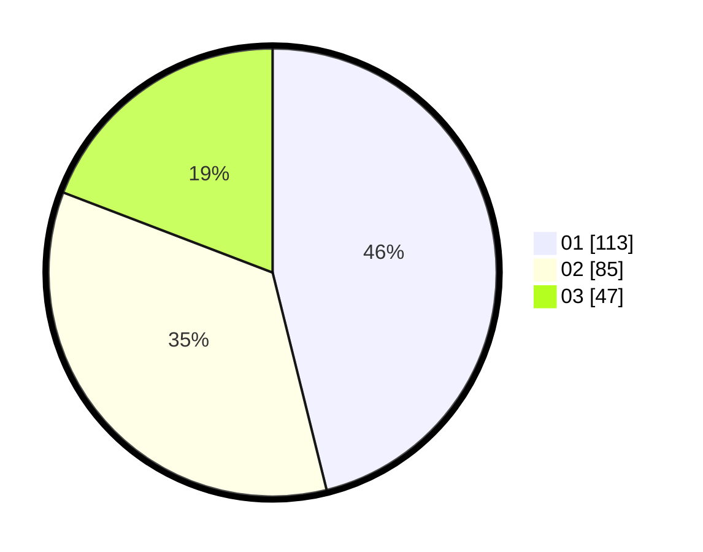

# Hasil

Hasil perolehan suara paslon dapat dilihat pada file paslon-01.txt, paslon-02.txt, dan paslon-03.txt.

Jika tidak ada, artinya data tersebut belum ada pada SIREKAP.

## Perolehan Suara

 * Paslon 01: **113**.
 * Paslon 02: **85**.
 * Paslon 03: **47**.

## Foto C Plano

https://sirekap-obj-formc.kpu.go.id/d8e2/pemilu/ppwp/31/74/04/10/01/3174041001060-20240214-220000--77f528d0-a2f3-4b94-b46e-63cf558318fd.jpg

https://sirekap-obj-formc.kpu.go.id/d8e2/pemilu/ppwp/31/74/04/10/01/3174041001060-20240214-220036--f8c606f4-3e3c-4242-bf9e-52128334c440.jpg

https://sirekap-obj-formc.kpu.go.id/d8e2/pemilu/ppwp/31/74/04/10/01/3174041001060-20240214-220116--0c0c27b3-a6e3-4c93-91d9-961d8a086f6e.jpg

## DATA PEMILIH TETAP

Jumlah pemilih dalam DPT: **282**.
 * L: **138**.
 * P: **144**.

## DATA PENGGUNA HAK PILIH

Jumlah pengguna hak pilih dalam DPT: **242**.
 * L: **115**.
 * P: **127**.

Jumlah pengguna hak pilih dalam DPTb: **4**.
 * L: **2**.
 * P: **2**.

Jumlah pengguna hak pilih dalam DPK: **2**.
 * L: **1**.
 * P: **1**.

Jumlah pengguna hak pilih: **248**.
 * L: **118**.
 * P: **130**.

## JUMLAH SUARA SAH DAN TIDAK SAH

JUMLAH SELURUH SUARA SAH: **245**.

JUMLAH SUARA TIDAK SAH: **3**.

JUMLAH SELURUH SUARA SAH DAN SUARA TIDAK SAH: **248**.
