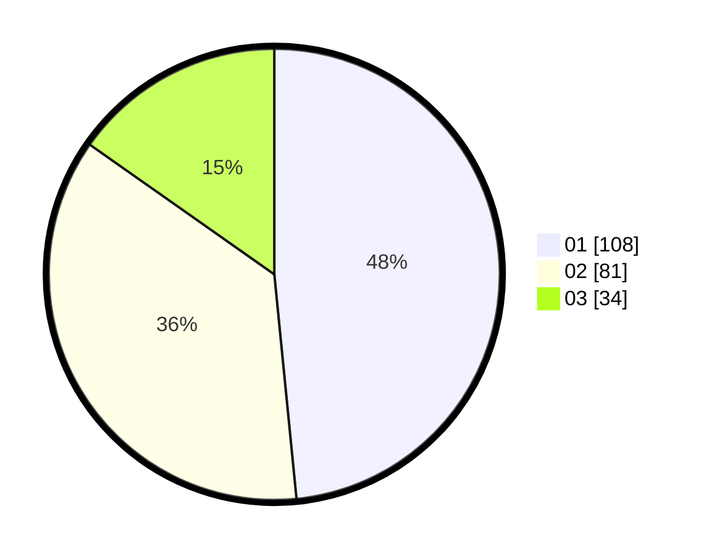

# Hasil

Hasil perolehan suara paslon dapat dilihat pada file paslon-01.txt, paslon-02.txt, dan paslon-03.txt.

Jika tidak ada, artinya data tersebut belum ada pada SIREKAP.

## Perolehan Suara

 * Paslon 01: **108**.
 * Paslon 02: **81**.
 * Paslon 03: **34**.

## Foto C Plano

https://sirekap-obj-formc.kpu.go.id/f6bd/pemilu/ppwp/31/74/04/10/01/3174041001061-20240214-211738--9a87236d-d4c9-4937-ab4b-531b838d9e41.jpg

https://sirekap-obj-formc.kpu.go.id/f6bd/pemilu/ppwp/31/74/04/10/01/3174041001061-20240214-194508--344daeda-c814-47b7-9e4b-fa1314ed1b63.jpg
