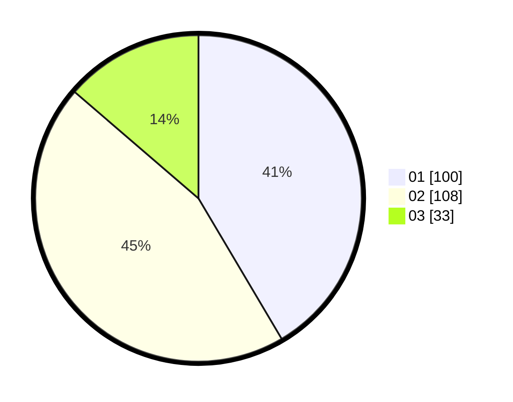

# Hasil

Hasil perolehan suara paslon dapat dilihat pada file paslon-01.txt, paslon-02.txt, dan paslon-03.txt.

Jika tidak ada, artinya data tersebut belum ada pada SIREKAP.

## Perolehan Suara

 * Paslon 01: **100**.
 * Paslon 02: **108**.
 * Paslon 03: **33**.

## Foto C Plano

https://sirekap-obj-formc.kpu.go.id/15aa/pemilu/ppwp/31/74/04/10/01/3174041001063-20240214-160123--ff6fdb4b-575b-4189-86be-83e6f507b00c.jpg

https://sirekap-obj-formc.kpu.go.id/15aa/pemilu/ppwp/31/74/04/10/01/3174041001063-20240214-162236--8de22382-91f6-4cb4-a95d-e77b881e74d7.jpg

https://sirekap-obj-formc.kpu.go.id/15aa/pemilu/ppwp/31/74/04/10/01/3174041001063-20240216-013054--877874f3-2cd6-4478-b49b-fd1809ed6e80.jpg

## DATA PEMILIH TETAP

Jumlah pemilih dalam DPT: **242**.
 * L: **114**.
 * P: **128**.

## DATA PENGGUNA HAK PILIH

Jumlah pengguna hak pilih dalam DPT: **242**.
 * L: **114**.
 * P: **128**.

Jumlah pengguna hak pilih dalam DPTb: **4**.
 * L: **3**.
 * P: **1**.

Jumlah pengguna hak pilih dalam DPK: **2**.
 * L: **1**.
 * P: **1**.

Jumlah pengguna hak pilih: **248**.
 * L: **118**.
 * P: **130**.

## JUMLAH SUARA SAH DAN TIDAK SAH

JUMLAH SELURUH SUARA SAH: **241**.

JUMLAH SUARA TIDAK SAH: **7**.

JUMLAH SELURUH SUARA SAH DAN SUARA TIDAK SAH: **248**.
