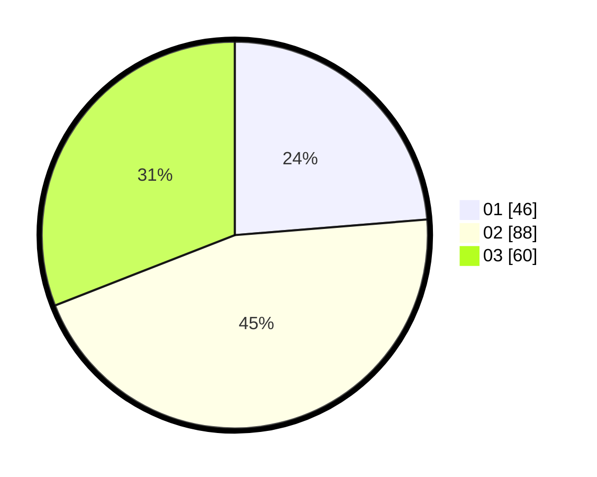

# Hasil

Hasil perolehan suara paslon dapat dilihat pada file paslon-01.txt, paslon-02.txt, dan paslon-03.txt.

Jika tidak ada, artinya data tersebut belum ada pada SIREKAP.

## Perolehan Suara

 * Paslon 01: **46**.
 * Paslon 02: **88**.
 * Paslon 03: **60**.

## Foto C Plano

https://sirekap-obj-formc.kpu.go.id/1831/pemilu/ppwp/31/74/04/10/01/3174041001064-20240214-155239--7959a043-220f-492d-a844-292ea86a0a53.jpg

https://sirekap-obj-formc.kpu.go.id/1831/pemilu/ppwp/31/74/04/10/01/3174041001064-20240214-155223--4c65867d-d034-4fc7-93df-73d03ef2bce0.jpg

https://sirekap-obj-formc.kpu.go.id/1831/pemilu/ppwp/31/74/04/10/01/3174041001064-20240214-155136--f8df2749-f70d-4916-8882-a91f3b34cd65.jpg

## DATA PEMILIH TETAP

Jumlah pemilih dalam DPT: **242**.
 * L: **122**.
 * P: **120**.

## DATA PENGGUNA HAK PILIH

Jumlah pengguna hak pilih dalam DPT: **196**.
 * L: **100**.
 * P: **96**.

Jumlah pengguna hak pilih dalam DPTb: **0**.
 * L: **0**.
 * P: **0**.

Jumlah pengguna hak pilih dalam DPK: **1**.
 * L: **1**.
 * P: **0**.

Jumlah pengguna hak pilih: **197**.
 * L: **101**.
 * P: **96**.

## JUMLAH SUARA SAH DAN TIDAK SAH

JUMLAH SELURUH SUARA SAH: **194**.

JUMLAH SUARA TIDAK SAH: **3**.

JUMLAH SELURUH SUARA SAH DAN SUARA TIDAK SAH: **197**.
