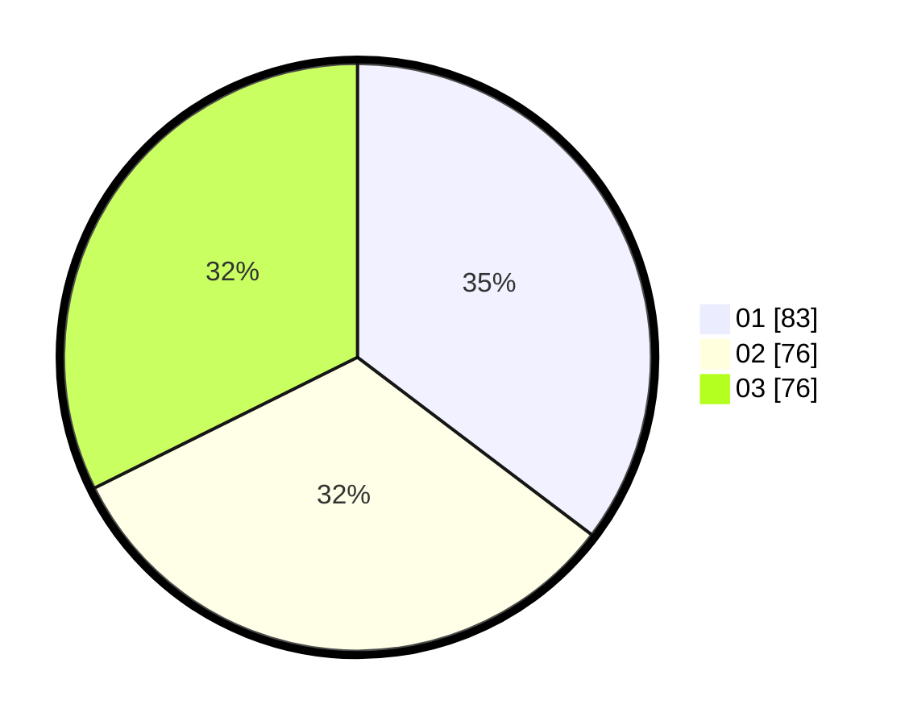

# Hasil

Hasil perolehan suara paslon dapat dilihat pada file paslon-01.txt, paslon-02.txt, dan paslon-03.txt.

Jika tidak ada, artinya data tersebut belum ada pada SIREKAP.

## Perolehan Suara

 * Paslon 01: **83**.
 * Paslon 02: **76**.
 * Paslon 03: **76**.

## Foto C Plano

https://sirekap-obj-formc.kpu.go.id/0989/pemilu/ppwp/31/74/04/10/01/3174041001068-20240214-202641--b2ff08c7-55c5-4058-9377-d503597f434c.jpg

https://sirekap-obj-formc.kpu.go.id/0989/pemilu/ppwp/31/74/04/10/01/3174041001068-20240214-202732--feffbacd-8a25-4ddb-831b-4dc06f824a5a.jpg

https://sirekap-obj-formc.kpu.go.id/0989/pemilu/ppwp/31/74/04/10/01/3174041001068-20240214-202901--20a43b9e-3cdb-4fc3-be94-072e281f8a1e.jpg

## DATA PEMILIH TETAP

Jumlah pemilih dalam DPT: **284**.
 * L: **125**.
 * P: **159**.

## DATA PENGGUNA HAK PILIH

Jumlah pengguna hak pilih dalam DPT: **230**.
 * L: **101**.
 * P: **129**.

Jumlah pengguna hak pilih dalam DPTb: **13**.
 * L: **3**.
 * P: **10**.

Jumlah pengguna hak pilih dalam DPK: **1**.
 * L: **0**.
 * P: **1**.

Jumlah pengguna hak pilih: **249**.
 * L: **104**.
 * P: **130**.

## JUMLAH SUARA SAH DAN TIDAK SAH

JUMLAH SELURUH SUARA SAH: **235**.

JUMLAH SUARA TIDAK SAH: **9**.

JUMLAH SELURUH SUARA SAH DAN SUARA TIDAK SAH: **244**.
